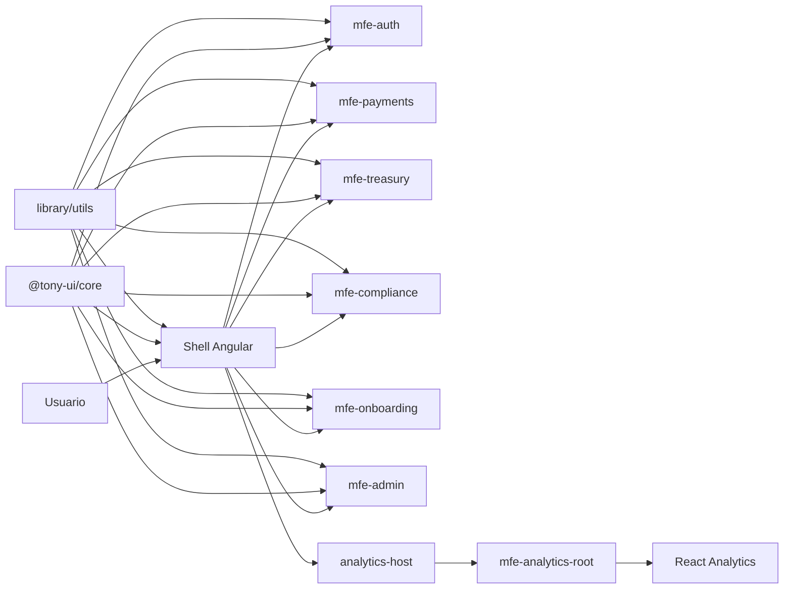
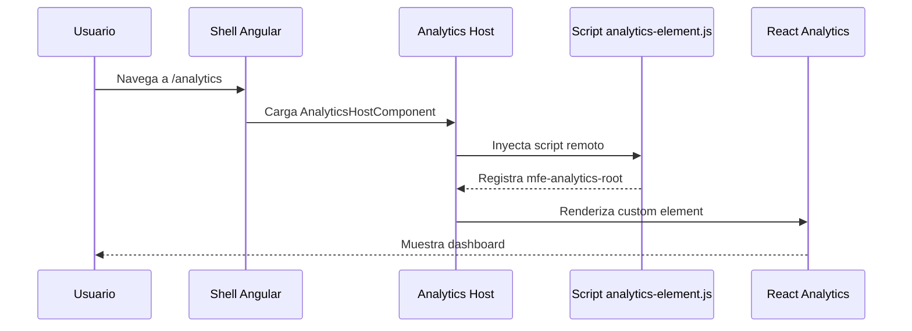
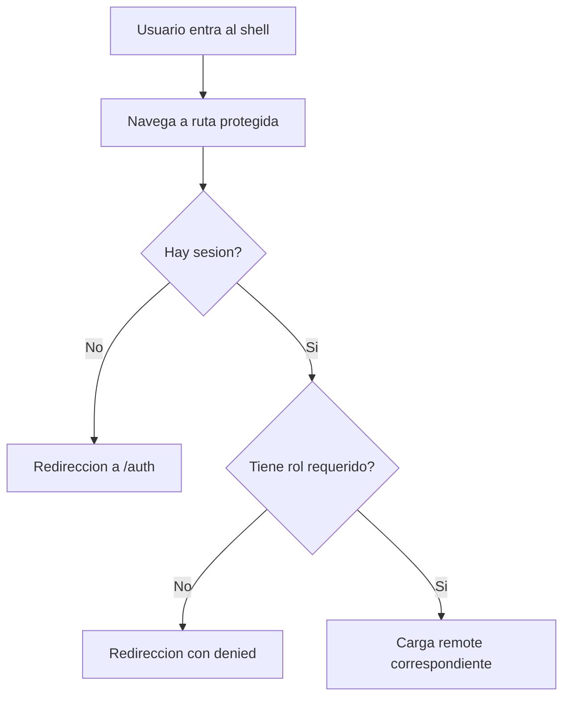
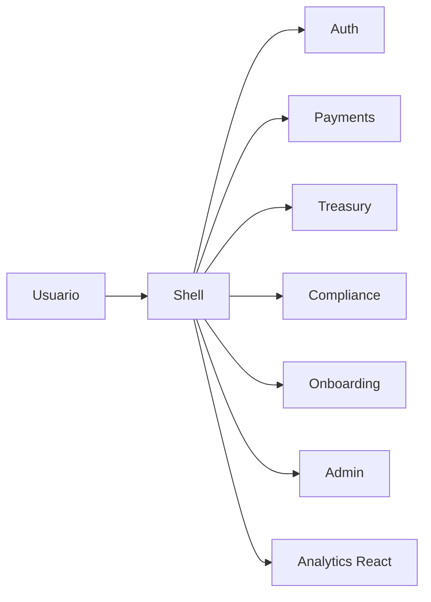
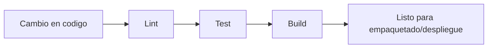
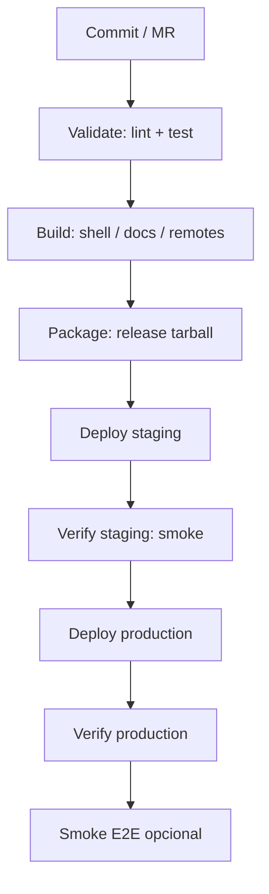
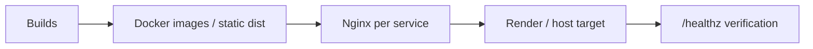

# CapitalFlow Frontend Platform

Monorepo Nx para la propuesta tecnica y el proyecto practico del caso CapitalFlow del examen Angular Expert.

Este repositorio no intenta ser solo una demo visual. Intenta demostrar una estrategia de modernizacion incremental de una plataforma financiera B2B con:

- composicion por dominios;
- microfrontends;
- convivencia Angular + React;
- libreria compartida;
- calidad automatizada;
- despliegue desacoplado;
- y una base operativa razonablemente seria para una evolucion enterprise.

---

## Tabla de contenidos

1. Vision del proyecto
2. Objetivos de arquitectura
3. Panorama funcional
4. Arquitectura general
5. Estructura del monorepo
6. Stack tecnico
7. Dominios y aplicaciones
8. Librerias compartidas
9. Integracion Angular + React
10. Flujos de usuario y navegacion
11. Calidad, testing y validacion
12. Pipelines y CI/CD
13. Despliegue y operacion
14. Como levantar el proyecto
15. Scripts utiles
16. Decisiones tecnicas importantes
17. Riesgos conocidos y mejoras futuras
18. FAQ tecnica

---

## 1. Vision del proyecto

CapitalFlow representa una plataforma SaaS financiera B2B que necesita evolucionar sin detener el negocio. El objetivo de este repositorio es modelar una solucion realista para ese problema:

- desacoplar dominios de negocio;
- reducir el radio de impacto de cambios;
- permitir evolucion independiente por equipo;
- mantener una experiencia de usuario consistente;
- y dejar una plataforma mas gobernable que una SPA monolitica.

La propuesta se apoya en dos ideas fuertes:

1. el frontend debe reflejar limites de negocio, no solo pantallas;
2. la modernizacion incremental exige convivir con la realidad actual, no negar su existencia.

Por eso conviven:

- varios microfrontends Angular sobre una base moderna y comun;
- un dominio React preservado e integrado mediante Web Components;
- una libreria `@tony-ui/core` que materializa estandarizacion visual y reutilizacion.

---

## 2. Objetivos de arquitectura

Los objetivos de esta solucion son:

- separar el sistema por dominios de negocio;
- mantener un `shell` como composition root;
- demostrar convivencia Angular + React sin reescritura forzada;
- centralizar UI, estilos y contratos transversales;
- habilitar validacion automatizada homogena;
- y modelar un despliegue por servicios, no por un unico artefacto monolitico.

Objetivos secundarios:

- usar Angular moderno de forma coherente;
- preparar el workspace para governance con Nx;
- dejar una base defendible ante un tribunal tecnico.

---

## 3. Panorama funcional

El sistema modela estas areas de negocio:

- `Auth`
- `Payments`
- `Treasury`
- `Compliance`
- `Onboarding`
- `Admin`
- `Analytics`

Cada una se refleja como dominio o microfrontend, salvo `shell`, que actua como punto de entrada y capa de composicion.

---

## 4. Arquitectura general

### 4.1 Resumen

La arquitectura esta organizada como:

- `shell` Angular que orquesta navegacion, layout y experiencia comun;
- varios remotes Angular por dominio;
- un remote React aislado como custom element;
- librerias compartidas para UI y utilidades;
- docs vivas de la libreria;
- despliegue por servicios.

### 4.2 Diagrama de alto nivel



### 4.3 Principios aplicados

- composicion por dominio;
- ownership funcional claro;
- shell como unica entrada al producto;
- shared UI como base de consistencia;
- React integrado sin contaminar el host;
- y una historia de evolucion incremental coherente.

---

## 5. Estructura del monorepo

```text
.
|-- apps/
|   |-- mfe-admin/
|   |-- mfe-analytics/
|   |-- mfe-auth/
|   |-- mfe-compliance/
|   |-- mfe-onboarding/
|   |-- mfe-payments/
|   `-- mfe-treasury/
|-- deliverables/
|-- deploy/
|   |-- docker/
|   `-- nginx/
|-- e2e/
|-- library/
|   `-- utils/
|-- projects/
|   |-- core/
|   |-- demo/
|   `-- docs/
|-- shell/
|-- tools/
|-- docker-compose.yml
|-- nx.json
|-- package.json
|-- playwright.config.ts
|-- render.yaml
`-- .gitlab-ci.yml
```

### Carpetas clave

- `shell/`: host Angular y composition root.
- `apps/`: remotes y aplicaciones por dominio.
- `projects/core/`: libreria UI compartida.
- `projects/docs/`: documentacion viva de la libreria.
- `library/utils/`: utilidades y modelos compartidos.
- `deploy/`: Dockerfiles y configuraciones Nginx.
- `e2e/`: pruebas end-to-end con Playwright.
- `tools/`: scripts de soporte del workspace.
- `deliverables/`: documentacion y entregables del examen.

---

## 6. Stack tecnico

### Core

- `Angular 21`
- `Nx 22`
- `TypeScript`
- `Webpack / Module Federation`
- `React 19` para `mfe-analytics`
- `Vitest`
- `Playwright`
- `Docker`
- `Nginx`

### Razon de stack

- Angular 21 para una base comun moderna en shell y dominios Angular.
- Nx como plataforma de gobierno del workspace.
- React preservado en Analytics para demostrar convivencia realista.
- Module Federation para composicion y separacion de remotes.
- Docker y Nginx como base de empaquetado y entrega desacoplada.

---

## 7. Dominios y aplicaciones

## 7.1 Shell

Ubicacion:

- [shell](/C:/Users/juan.escobar/Desktop/mono-repo/tony-monorepo/shell)

Responsabilidades:

- composition root;
- rutas principales;
- layout y experiencia transversal;
- host del dominio React;
- control de acceso de navegacion;
- carga de remotes.

Rutas principales:

- `/`
- `/auth`
- `/payments`
- `/treasury`
- `/analytics`
- `/compliance`
- `/onboarding`
- `/admin`

Archivo clave:

- [app.routes.ts](/C:/Users/juan.escobar/Desktop/mono-repo/tony-monorepo/shell/src/app/app.routes.ts)

## 7.2 `mfe-auth`

Ubicacion:

- [apps/mfe-auth](/C:/Users/juan.escobar/Desktop/mono-repo/tony-monorepo/apps/mfe-auth)

Responsabilidad:

- modelar experiencia de autenticacion y acceso demo;
- introducir session + role routing a nivel de frontend.

## 7.3 `mfe-payments`

Ubicacion:

- [apps/mfe-payments](/C:/Users/juan.escobar/Desktop/mono-repo/tony-monorepo/apps/mfe-payments)

Responsabilidad:

- dominio de pagos.

## 7.4 `mfe-treasury`

Ubicacion:

- [apps/mfe-treasury](/C:/Users/juan.escobar/Desktop/mono-repo/tony-monorepo/apps/mfe-treasury)

Responsabilidad:

- dominio de tesoreria.

## 7.5 `mfe-compliance`

Ubicacion:

- [apps/mfe-compliance](/C:/Users/juan.escobar/Desktop/mono-repo/tony-monorepo/apps/mfe-compliance)

Responsabilidad:

- reporting regulatorio y flujos protegidos por rol.

## 7.6 `mfe-onboarding`

Ubicacion:

- [apps/mfe-onboarding](/C:/Users/juan.escobar/Desktop/mono-repo/tony-monorepo/apps/mfe-onboarding)

Responsabilidad:

- alta y operacion inicial de clientes.

## 7.7 `mfe-admin`

Ubicacion:

- [apps/mfe-admin](/C:/Users/juan.escobar/Desktop/mono-repo/tony-monorepo/apps/mfe-admin)

Responsabilidad:

- operaciones administrativas y configuracion.

## 7.8 `mfe-analytics`

Ubicacion:

- [apps/mfe-analytics](/C:/Users/juan.escobar/Desktop/mono-repo/tony-monorepo/apps/mfe-analytics)

Responsabilidad:

- analitica e informes en React.

Caracteristica diferencial:

- no se fuerza su migracion a Angular;
- se expone como custom element y se hospeda dentro del shell.

Archivos clave:

- [analytics-element.tsx](/C:/Users/juan.escobar/Desktop/mono-repo/tony-monorepo/apps/mfe-analytics/src/app/analytics-element.tsx)
- [analytics-host.component.ts](/C:/Users/juan.escobar/Desktop/mono-repo/tony-monorepo/shell/src/app/analytics-host.component.ts)

---

## 8. Librerias compartidas

## 8.1 `@tony-ui/core`

Ubicacion:

- [projects/core](/C:/Users/juan.escobar/Desktop/mono-repo/tony-monorepo/projects/core)

Rol:

- libreria UI reutilizable;
- materializacion del design system;
- base compartida entre shell y remotes Angular.

Incluye:

- componentes;
- directivas;
- providers;
- estilos comunes;
- tests;
- empaquetado con `ng-packagr`.

Superficie publica:

- [public-api.ts](/C:/Users/juan.escobar/Desktop/mono-repo/tony-monorepo/projects/core/src/public-api.ts)

## 8.2 `library/utils`

Ubicacion:

- [library/utils](/C:/Users/juan.escobar/Desktop/mono-repo/tony-monorepo/library/utils)

Rol:

- auth-session demo;
- modelos ligeros;
- utilidades compartidas.

Ejemplo clave:

- [auth-session.ts](/C:/Users/juan.escobar/Desktop/mono-repo/tony-monorepo/library/utils/src/lib/auth-session.ts)

## 8.3 `projects/docs`

Ubicacion:

- [projects/docs](/C:/Users/juan.escobar/Desktop/mono-repo/tony-monorepo/projects/docs)

Rol:

- documentacion viva;
- catalogo de componentes;
- soporte de onboarding tecnico.

---

## 9. Integracion Angular + React

Esta es una de las decisiones mas importantes del proyecto.

### Objetivo

Preservar el dominio de Analytics en React sin forzar una reescritura global, pero manteniendo una experiencia unificada desde el shell Angular.

### Patron elegido

- React se empaqueta como custom element;
- Angular lo hospeda mediante `CUSTOM_ELEMENTS_SCHEMA`;
- el shell carga el script remoto y monta el componente.

### Beneficios

- evita una migracion ideologica;
- reduce coste de cambio;
- mantiene frontera clara entre runtimes;
- demuestra convivencia realista.

### Diagrama



---

## 10. Flujos de usuario y navegacion

### 10.1 Flujo de autenticacion y acceso



### 10.2 Flujo de composicion por dominio



---

## 11. Calidad, testing y validacion

## 11.1 Testing

El proyecto combina:

- tests unitarios / integracion ligera con `Vitest`;
- E2E con `Playwright`.

Resultado verificado:

- `494` tests superados;
- `61` archivos de test en la ejecucion validada.

Archivos clave:

- [playwright.config.ts](/C:/Users/juan.escobar/Desktop/mono-repo/tony-monorepo/playwright.config.ts)
- [package.json](/C:/Users/juan.escobar/Desktop/mono-repo/tony-monorepo/package.json)

## 11.2 Quality gates

El workspace ya dispone de:

- `lint`
- `test`
- `build`

agrupados en:

```bash
npm run ci:validate
```

### Flujo de validacion



## 11.3 Hallazgos reales

La validacion ejecutada fue positiva, pero existe un warning real en `docs`:

- el budget inicial de produccion se supera.

Esto forma parte de los hallazgos honestos del proyecto y es una oportunidad clara de optimizacion posterior.

---

## 12. Pipelines y CI/CD

## 12.1 GitHub Actions

Archivo:

- [.github/workflows/ci.yml](/C:/Users/juan.escobar/Desktop/mono-repo/tony-monorepo/.github/workflows/ci.yml)

Funcion:

- validacion general del workspace en `push` y `pull_request`.

Pasos:

1. checkout
2. setup Node 22
3. `npm ci`
4. `npm run ci:validate`

## 12.2 GitLab CI

Archivo:

- [.gitlab-ci.yml](/C:/Users/juan.escobar/Desktop/mono-repo/tony-monorepo/.gitlab-ci.yml)

Es el pipeline mas completo del repositorio.

Stages:

- `validate`
- `build`
- `package`
- `deploy`
- `verify`

Capacidades relevantes:

- reglas por cambios;
- builds por dominio;
- empaquetado en tarball;
- deploy a staging y production;
- smoke tests por `healthz`;
- E2E opcional con Playwright.

### Diagrama del pipeline



### Lectura senior

Este pipeline no debe venderse como el estado final absoluto de una gran fintech, pero si como una base de industrializacion muy superior a un flujo artesanal o monolitico.

---

## 13. Despliegue y operacion

## 13.1 Docker Compose

Archivo:

- [docker-compose.yml](/C:/Users/juan.escobar/Desktop/mono-repo/tony-monorepo/docker-compose.yml)

Sirve para levantar localmente:

- shell;
- remotes;
- docs.

Es util para:

- demos;
- validacion local integrada;
- pruebas de composicion multi-servicio.

## 13.2 Dockerfiles

Ubicacion:

- [deploy/docker](/C:/Users/juan.escobar/Desktop/mono-repo/tony-monorepo/deploy/docker)

Cada app tiene su Dockerfile.

Beneficio:

- empaquetado desacoplado por servicio;
- mayor cercania a un modelo de despliegue independiente.

## 13.3 Nginx

Ubicacion:

- [deploy/nginx](/C:/Users/juan.escobar/Desktop/mono-repo/tony-monorepo/deploy/nginx)

Archivos principales:

- [spa.conf](/C:/Users/juan.escobar/Desktop/mono-repo/tony-monorepo/deploy/nginx/spa.conf)
- [static.conf](/C:/Users/juan.escobar/Desktop/mono-repo/tony-monorepo/deploy/nginx/static.conf)

Responsabilidades:

- servir artefactos estaticos;
- exponer `/healthz`;
- aplicar algunos headers de seguridad;
- soportar shell SPA y remotes estaticos.

## 13.4 Render

Archivo:

- [render.yaml](/C:/Users/juan.escobar/Desktop/mono-repo/tony-monorepo/render.yaml)

Modela despliegue por servicio:

- shell;
- cada MFE;
- docs.

Ventajas:

- separacion operativa;
- variables por servicio;
- `buildFilter.paths` para evitar reconstrucciones innecesarias.

## 13.5 Modelo de despliegue resumido



---

## 14. Como levantar el proyecto

## 14.1 Requisitos

- Node.js 22 recomendado
- npm
- Docker Desktop si quieres usar contenedores

## 14.2 Instalacion

```bash
npm ci
```

## 14.3 Desarrollo rapido

Levantar todo:

```bash
npm run dev:all
```

Levantar solo shell:

```bash
npm run dev:shell
```

Levantar un dominio concreto:

```bash
npm run dev:auth
npm run dev:payments
npm run dev:treasury
npm run dev:analytics
npm run dev:docs
```

## 14.4 URLs locales habituales

| Servicio       | URL                     |
| -------------- | ----------------------- |
| shell          | `http://localhost:4200` |
| mfe-payments   | `http://localhost:4201` |
| mfe-treasury   | `http://localhost:4202` |
| mfe-analytics  | `http://localhost:4203` |
| mfe-auth       | `http://localhost:4204` |
| mfe-compliance | `http://localhost:4205` |
| mfe-onboarding | `http://localhost:4206` |
| mfe-admin      | `http://localhost:4207` |
| docs           | `http://localhost:4301` |

## 14.5 Validacion local

Tests:

```bash
npm test
```

Build:

```bash
npm run build
```

Validacion completa:

```bash
npm run ci:validate
```

## 14.6 Levantar con Docker

```bash
npm run docker:up
```

Apagar:

```bash
npm run docker:down
```

---

## 15. Scripts utiles

### Desarrollo

```bash
npm run dev:all
npm run dev:shell
npm run dev:auth
npm run dev:payments
npm run dev:treasury
npm run dev:analytics
npm run dev:docs
```

### Calidad

```bash
npm test
npm run build
npm run ci:validate
```

### E2E

```bash
npm run test:e2e
npm run test:e2e:headed
```

### Docs

```bash
npm run docs:dev
npm run docs:build
```

### Docker

```bash
npm run docker:up
npm run docker:down
```

### Nx directo

```bash
npx nx show projects
npx nx build core
npx nx test core
npx nx serve shell
npx nx graph
```

---

## 16. Decisiones tecnicas importantes

## 16.1 Por que Angular 21 en shell y micros Angular

Porque el objetivo no es congelar tecnologia antigua, sino unificar la nueva plataforma objetivo en una base moderna y coherente. La continuidad del negocio se protege migrando por slices, no manteniendo eternamente la heterogeneidad.

## 16.2 Por que Nx

Porque aqui no se gobierna una sola app. Se gobiernan:

- shell;
- remotes;
- librerias;
- docs;
- tooling;
- CI/CD.

Nx aporta:

- orquestacion;
- cache;
- convenciones;
- base para evolucionar governance.

## 16.3 Por que React se mantiene

Porque reescribir Analytics en Angular no aporta valor inmediato comparable al coste. La integracion via custom element es mas realista, mas barata y mas defendible.

## 16.4 Por que microfrontends por dominio

Porque la separacion tiene sentido cuando sigue ownership y bounded contexts, no cuando trocea por capricho cada componente.

---

## 17. Riesgos conocidos y mejoras futuras

El proyecto es fuerte, pero no perfecto. Puntos a tener presentes:

### 17.1 Seguridad

- auth actual de demo en `localStorage`;
- autorizacion principalmente de navegacion, no enterprise completa.

### 17.2 Governance Nx

- `module boundaries` existen pero aun son laxos;
- falta endurecer tags por dominio / tipo / scope.

### 17.3 Integracion

- seria deseable mas contract tests host/remote;
- mas smoke tests automatizados por dominio.

### 17.4 Runtime config

- el shell mezcla variables de entorno y sustitucion de valores via Docker para algunas URLs;
- seria mejor una estrategia mas uniforme.

### 17.5 Performance

- `docs` supera el budget inicial de produccion.

### 17.6 Evolucion recomendada

1. mover auth a backend real;

---

## 18. FAQ tecnica

### "Esto son microfrontends de verdad si es un monorepo?"

Si. Monorepo y despliegue desacoplado no son incompatibles. El monorepo resuelve gobierno del codigo; el despliegue desacoplado resuelve autonomia operativa.

### "Por que no una SPA unica?"

Porque el caso exige desacoplar equipos, reducir radio de impacto y permitir evolucion incremental por dominio.

### "Por que no migrar todo React a Angular?"

Porque el objetivo no es reescribir por ideologia, sino evolucionar sin destruir valor existente.

### "Que es lo mas fuerte del repo?"

- la composicion por dominios;
- la convivencia Angular + React;
- la libreria compartida real;
- la base de calidad y despliegue ya existente.

### "Que es lo mas debil hoy?"

- auth enterprise no finalizada;

---

## Cierre

Este repositorio debe leerse como una plataforma de modernizacion incremental, no como una demo aislada. Su mayor valor no es una sola pantalla ni un solo microfrontend. Su mayor valor es que junta arquitectura, implementacion, calidad y operacion en una historia coherente y defendible.

La conclusion correcta es esta:

> CapitalFlow ya dispone aqui de una base tecnica capaz de demostrar que la modernizacion por dominios, la convivencia de stacks y el despliegue desacoplado son viables sin detener el negocio.
