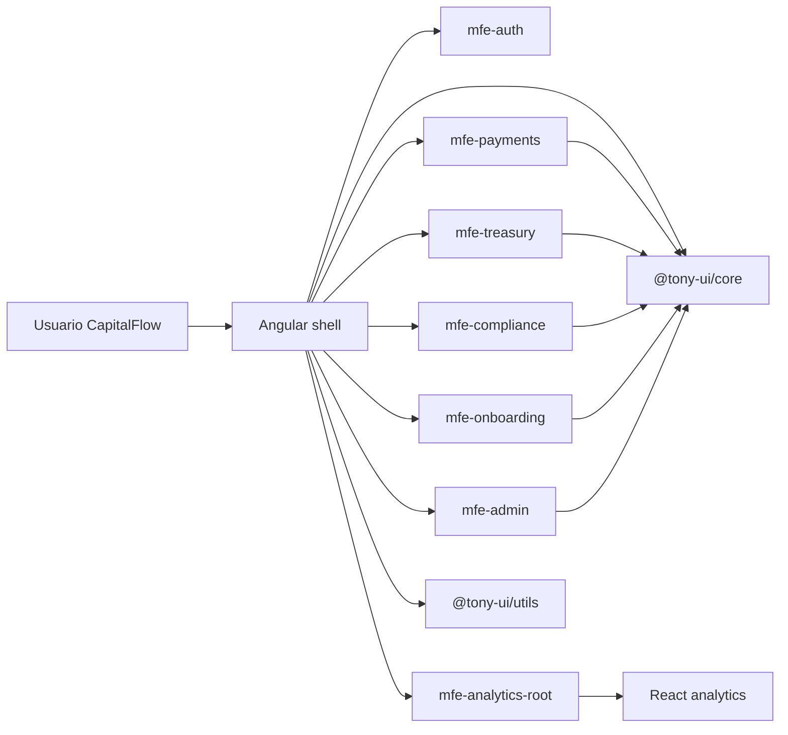

# Propuesta Técnica para CapitalFlow

## 1. Executive Summary

CapitalFlow tiene un riesgo técnico real para la ronda Serie B por cuatro razones: arquitectura acoplada, rendimiento insuficiente, exposición grave en seguridad y un proceso de despliegue frágil. La recomendación es ejecutar una modernización incremental en 6 meses, sin detener el delivery, con un enfoque de `Nx + microfrontends + librería de componentes + hardening de seguridad + CI/CD automatizado`.

La propuesta minimiza riesgo operativo porque no exige una reescritura total. En su lugar, crea una plataforma de coexistencia para Angular y React, permite despliegues por dominio, reduce el bundle inicial, encapsula la deuda técnica más peligrosa y establece controles de seguridad y calidad que hoy no existen.

En 8 semanas el objetivo no es "terminar la transformación", sino demostrar a Board e inversores que:

1. Existe una arquitectura objetivo creíble.
2. Ya hay una primera vertical funcionando.
3. Seguridad, rendimiento y despliegue tienen un plan ejecutable con métricas.
4. Los equipos pueden seguir entregando producto durante la transición.

## 2. Diagnóstico de situación actual

### Problemas críticos

1. Arquitectura monolítica de entrega.
   El build y deploy únicos bloquean a todos los equipos, elevan el tiempo de recuperación y convierten cualquier fix en riesgo sistémico.

2. Incompatibilidad tecnológica entre dominios.
   Conviven múltiples versiones de Angular y un equipo React sin una estrategia de integración estable.

3. Rendimiento insuficiente para clientes enterprise.
   El bundle inicial y el procesamiento en cliente ya están afectando renovaciones y SLA.

4. Brecha de seguridad grave.
   El informe de auditoría describe fallos incompatibles con una fintech regulada: XSS almacenado y reflejado, uso inseguro de `iframe`, carga de archivos sin sanitización, ausencia de CSP y flags inseguros en cookies.

5. Deuda técnica estructural.
   Servicios monolíticos, componentes gigantes, duplicación funcional y baja cobertura hacen que cada cambio sea caro y arriesgado.

6. Operación manual.
   Sin staging fiable, sin health checks, sin tests en pipeline y con rollback manual, la continuidad de servicio no es defendible ante inversores.

### Priorización

Prioridad 1:

- Remediación de seguridad crítica.
- Separación de despliegues por dominio.
- Métricas de rendimiento y quick wins.

Prioridad 2:

- Librería compartida.
- Refactoring de los módulos más costosos.
- Pipeline CI/CD con controles automáticos.

Prioridad 3:

- Estandarización de patterns de equipo.
- Mejora progresiva de cobertura.
- Optimización avanzada y observabilidad de negocio.

## 3. Arquitectura objetivo

### Principios

- Un monorepo Nx como plataforma de coordinación, no como monolito de despliegue.
- Microfrontends por dominio de negocio.
- Shell Angular como composición principal.
- Remotes Angular para dominios Angular.
- Integración del dominio React mediante Web Components para no forzar migración.
- Librerías compartidas desacopladas del dominio.
- Contratos claros entre equipos.

### Propuesta

- `shell`: navegación, autenticación transversal, layout, observabilidad y composition root.
- `mfe-payments`: ownership del equipo Payments, despliegue independiente.
- `mfe-treasury`: ownership del equipo Treasury, despliegue independiente.
- `mfe-analytics`: equipo React, integrado como custom element para preservar autonomía.
- `libs/core`: librería `@tony-ui/core` con sistema de diseño y componentes Angular compartidos.
- `libs/utils`: tipos, formateadores, helpers y contratos comunes.

### Diagrama de composición

### Evidencia práctica incluida

El repositorio entrega una vertical ejecutable que demuestra la arquitectura objetivo:

- Shell Angular con lazy loading por rutas federadas.
- Seis remotes Angular desacoplados por dominio.
- Analytics en React cargado por el shell como Web Component, sin obligar al equipo a migrar.
- Librería `@tony-ui/core` con componentes reutilizables, documentación y tests automatizados.
- Docker Compose, Nginx con health checks y workflow de CI reproducible.

### Coexistencia de Angular y React

La convivencia se resuelve en tres capas:

1. Design tokens compartidos.
   Variables CSS, escala tipográfica, spacing y semántica visual comunes.

2. Fronteras de integración cross-framework.
   Angular standalone para equipos Angular y custom elements para dominios no Angular.

3. Contrato de integración estable.
   El shell consume el dominio React como custom element, no como dependencia directa de React internals.

### Alternativas descartadas

- Reescritura total a una única versión de Angular.
  Descartada por coste, riesgo y calendario.

- Federar React directamente dentro de Angular sin capa de diseño compartida.
  Descartada porque resuelve integración técnica, pero no consistencia visual ni independencia real.

- Mantener repositorios separados.
  Descartada porque complica gobierno, visibilidad de dependencias y reutilización.

## 4. Plan de optimización de rendimiento

### Medidas inmediatas

- Lazy loading completo de dominios.
- División por remotes para sacar código del bundle inicial.
- Imports dinámicos para secciones pesadas.
- Paginación o virtualización en grids de gran volumen.
- Offloading de exportaciones pesadas a backend o Web Worker.
- Presupuestos de bundle por app.

### Medidas de segunda fase

- SSR/edge rendering solo donde haya beneficio real.
- Caching agresivo de assets versionados.
- Telemetría de Web Vitals por cliente y país.
- Optimización de imágenes, fuentes y polyfills.

### Targets

- Bundle inicial del shell: de 2.8 MB a < 800 KB comprimido.
- FCP en 4G: de 9.2 s a < 3.5 s.
- TTI: de 14 s a < 5 s.
- Tabla masiva: de congelación total a interacción fluida con paginación/virtualización.

### Navegadores legacy

IE11 no debe condicionar la arquitectura principal. Recomendación:

- Definir fecha de sunset negociada con clientes legacy.
- Mantener compatibilidad mínima mediante fallback temporal o portal legacy aislado.
- No bloquear la modernización principal por un 6% de usuarios.

## 5. Estrategia de seguridad

### Remediación inmediata

- Eliminar renderizado inseguro de HTML y comentarios.
- Sustituir `bypassSecurityTrust...` por validación estricta y sanitización controlada.
- Validar y normalizar filenames y metadatos de subida.
- Escapar siempre términos de búsqueda reflejados en UI.
- Encapsular el editor WYSIWYG con allowlist de tags/atributos.
- Configurar CSP estricta por entorno.
- Forzar `HttpOnly`, `Secure` y `SameSite` en cookies.

### Controles permanentes

- ESLint rules de seguridad.
- SAST en pipeline.
- Dependency scanning.
- Checklist de secure coding en PR.
- Formación trimestral de Angular Security y OWASP.

### WYSIWYG

No se elimina. Se mantiene con:

- Sanitización server-side.
- Allowlist de HTML.
- Vista previa segura.
- Política clara de contenido permitido.

## 6. Roadmap de refactoring incremental

### Orden recomendado

1. Extraer librerías compartidas.
2. Aislar servicios "dios" en facades y servicios de dominio.
3. Adoptar standalone components y boundaries de Nx.
4. Introducir pattern de estado por feature.
5. Reducir componentes >800 líneas en slices presentational/container.

### Patrones

- Facade pattern.
- Adapter pattern para integraciones legacy.
- Ports and adapters para infra sensible.
- Presentational/container split.
- Feature libraries por dominio.

### Métricas

- Tiempo medio de build.
- Tiempo medio de PR.
- Cobertura en dominios criticos.
- Numero de duplicaciones eliminadas.
- Numero de componentes y servicios por encima de umbrales definidos.

## 7. Libreria de componentes compartidos

### Objetivo

Eliminar duplicacion, dar consistencia visual y permitir que Angular y React compartan experiencia de usuario sin compartir framework.

### Diseño de la solución

- Tokens visuales en CSS variables.
- Componentes Angular standalone para ecosistema Angular.
- Web Components para integraciones cross-framework.
- Versionado semántico.
- Catalogo vivo de componentes y contratos de compatibilidad.

### Gobierno

- Core team de plataforma como owner.
- RFC ligero para breaking changes.
- Changelog y codemods para cambios mayores.

## 8. Modernización del despliegue

### Estado objetivo

- CI con tests, lint, build y security gates.
- CD por dominio.
- Entorno staging realista.
- Deploy blue/green o rolling con zero-downtime.
- Health checks, smoke tests y rollback automatizado.

### Pipeline propuesto

1. PR validation:
   lint, tests, build affected, SAST, dependency scan.
2. Merge to main:
   build versionado, artefactos firmados.
3. Deploy a staging:
   smoke tests y validación funcional.
4. Deploy a producción:
   progresivo, con métricas y rollback automático.

### Infraestructura

- Docker por aplicación.
- Orquestación gestionada en nube.
- CDN para assets estáticos.
- Secret management centralizado.

## 9. Plan de ejecución a 6 meses

### Fase 0. Semanas 1-2

- Crear equipo de plataforma.
- Acordar arquitectura objetivo.
- Establecer métricas baseline.
- Corregir vulnerabilidades críticas más expuestas.

### Fase 1. Semanas 3-8

- Crear monorepo Nx.
- Implementar shell y primeros remotes.
- Crear `libs/core` y `libs/utils`.
- Integrar React mediante Web Components.
- Activar CI mínima y staging fiable.

### Fase 2. Semanas 9-16

- Migrar dominios prioritarios.
- Refactoring de servicios críticos.
- Introducir observabilidad y budgets.
- Endurecer CSP, cookies y validaciones.

### Fase 3. Semanas 17-24

- Escalar la librería compartida.
- Completar despliegues independientes.
- Mejorar cobertura y runbooks.
- Preparar cierre de hallazgos de auditoría.

## 10. Análisis de riesgos

Riesgo:
Resistencia de equipos.
Mitigación:
Arquitectura de coexistencia, no migración forzada.

Riesgo:
Sobrecarga del equipo plataforma.
Mitigación:
Priorizar dominios críticos y usar templates repetibles.

Riesgo:
Cambios de seguridad rompen UX.
Mitigación:
Feature flags, allowlists y validación con negocio.

Riesgo:
La due diligence llegue antes de materializar suficientes resultados.
Mitigación:
Entregar en 8 semanas una vertical demostrable, roadmap cuantificado y KPIs de avance.

## 11. Métricas de éxito

### KPIs técnicos

- Tiempo de build total.
- Tiempo de deploy.
- Tasa de fallos de deploy.
- FCP y TTI por mercado.
- Cobertura de tests en dominios críticos.
- Número de vulnerabilidades críticas abiertas.
- Tamaño del bundle inicial del shell.

### KPIs de negocio

- Renovación de clientes con incidencias de performance.
- Incidentes SLA por trimestre.
- Tiempo medio de entrega por feature.
- Número de releases independientes por equipo.

### Targets por fase

En 8 semanas:

- arquitectura demostrable
- primer dominio desacoplado
- CI funcional
- quick wins de seguridad y rendimiento visibles

En 6 meses:

- despliegue por dominio
- zero-downtime operativo
- auditoría de seguridad bajo control
- mejora material de NPS técnico de clientes enterprise

## Respuesta a la pregunta del inversor

Si Analytics quiere seguir en React de forma indefinida, la experiencia unificada se consigue sin forzar migración mediante:

1. Sistema de diseño compartido y gobernado.
2. Web Components para encapsular UI reutilizable entre frameworks.
3. Tokens visuales y guidelines únicos.
4. Contratos de integración estables.
5. Observabilidad común para medir que la UX realmente es consistente.

Eso permite autonomía tecnológica por equipo sin fragmentar la experiencia del usuario final.
