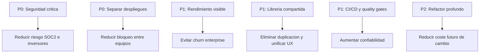
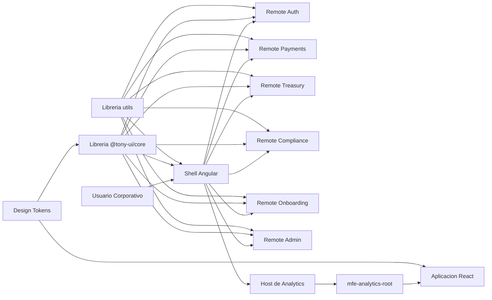
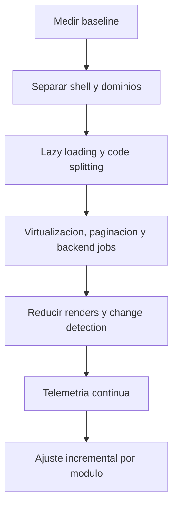
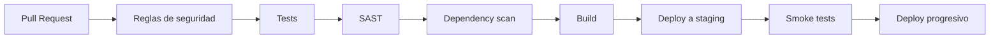
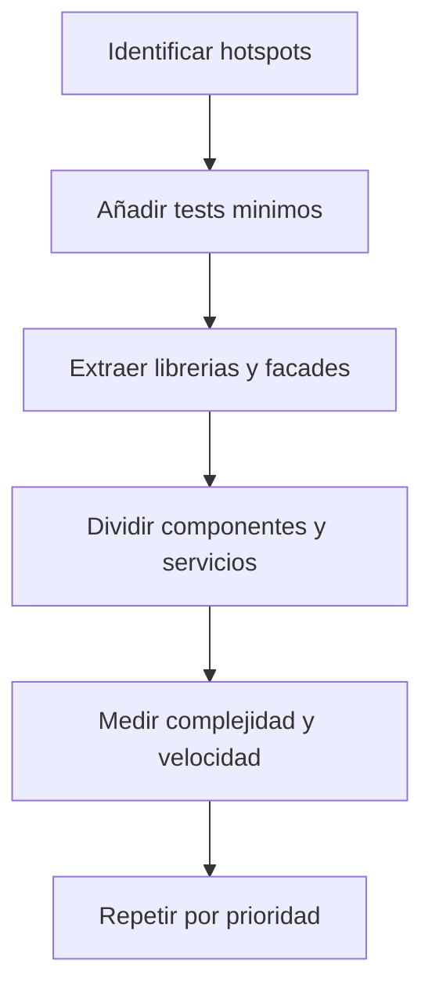
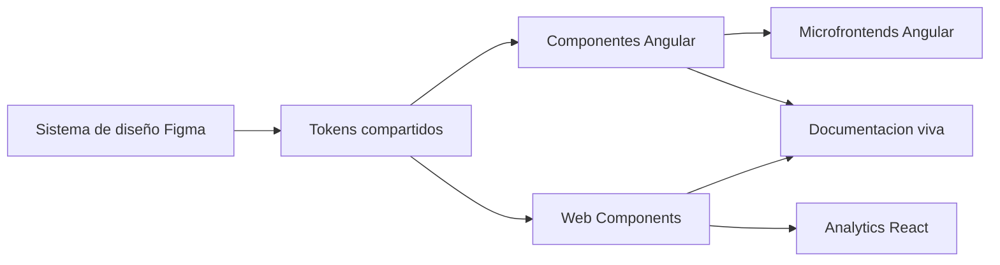
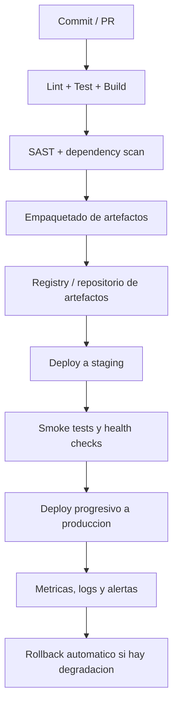
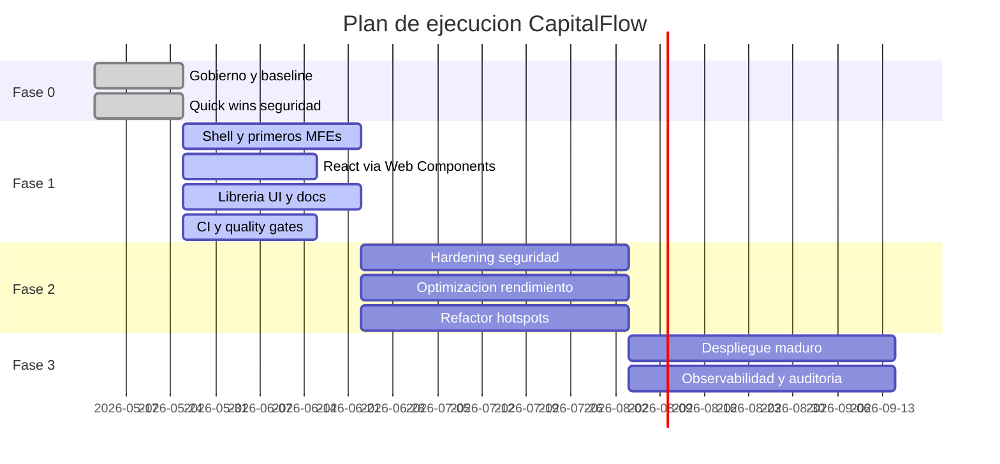

# CapitalFlow

## Propuesta Tecnica Integral para Board e Inversores

**Documento:** Respuesta formal al "Examen Angular Expert"  
**Autor:** Juan Escobar / Tony  
**Rol asumido:** Arquitecto Consultor Externo  
**Version:** 2.0  
**Fecha:** 7 de mayo de 2026  
**Horizonte del plan:** 6 meses  
**Ventana critica:** Due diligence en 8 semanas  
**Extension objetivo:** 15-25 paginas equivalentes en formato PDF

---

## Portada Ejecutiva

CapitalFlow necesita demostrar ante Board e inversores que comprende con precision su deuda tecnica, que ha elegido una arquitectura objetivo realista y que puede ejecutar una modernizacion incremental sin detener el negocio. El presente documento cumple esa funcion: traduce el contexto del examen en un plan tecnico profesional, trazable y defendible.

La propuesta no se limita a una opinion arquitectonica. Se apoya en una implementacion practica ya existente en el repositorio, que demuestra:

- Shell Angular con composicion por dominio.
- Microfrontends Angular desacoplados por ownership de negocio.
- Integracion de React mediante Web Components.
- Libreria de componentes compartida.
- Quality gates homogeneos de `lint`, `test` y `build`.
- Pipeline reproducible con Docker, Nginx, health checks y validacion automatizada.

Al mismo tiempo, el documento mantiene una postura honesta: distingue entre lo ya demostrado en el proyecto practico y lo que debe completarse en la siguiente fase para alcanzar un nivel enterprise regulado pleno.

---

## Indice

1. Matriz de cumplimiento del examen
2. Executive Summary
3. Diagnostico de situacion actual
4. Arquitectura objetivo
5. Plan de optimizacion de rendimiento
6. Estrategia de seguridad
7. Roadmap de refactoring incremental
8. Libreria de componentes compartidos
9. Modernizacion del despliegue
10. Plan de ejecucion a 6 meses
11. Analisis de riesgos
12. Metricas de exito
13. Respuesta a la pregunta del inversor sobre React
14. Evidencia practica ya implementada
15. Conclusion ejecutiva

---

## 1. Matriz de Cumplimiento del Examen

El PDF del examen solicita una propuesta formal de entre 15 y 25 paginas, orientada a Board, estructurada en 11 secciones. La siguiente matriz resume el nivel de cumplimiento alcanzado por este entregable y por el repositorio asociado.

| Requisito del examen | Estado del documento | Estado de la implementacion | Comentario |
|---|---|---|---|
| Executive Summary de maximo 1 pagina | Cumple | N/A | Cubierto en tono board-friendly |
| Diagnostico actual con causas raiz e impacto | Cumple | Cumple parcialmente | El documento cubre todo; el repo demuestra parte de la solucion |
| Arquitectura objetivo con diagramas | Cumple | Cumple | Shell Angular, MFEs, React y libreria compartida ya existen |
| Coexistencia entre versiones Angular y React | Cumple | Cumple como vertical | Resuelto en la propuesta y demostrado con Web Components |
| Plan de rendimiento con metricas objetivo | Cumple | Cumple parcialmente | Se define plan y targets; falta medicion productiva real |
| Estrategia de seguridad con remediacion de 11 vulnerabilidades | Cumple | Cumple parcialmente | Existe hardening base, pero aun hay gaps demo vs produccion |
| Roadmap de refactoring incremental | Cumple | Cumple como estrategia | El repo demuestra direccion, no el refactor completo de 280k LOC |
| Libreria de componentes compartidos | Cumple | Cumple | `@tony-ui/core` y docs vivas |
| Modernizacion del despliegue con zero-downtime | Cumple | Cumple parcialmente | Docker, Nginx y health checks existen; falta CD cloud real |
| Plan de ejecucion a 6 meses | Cumple | N/A | Cubierto en detalle |
| Analisis de riesgos | Cumple | N/A | Cubierto con mitigaciones |
| KPIs tecnicos y de negocio | Cumple | Cumple parcialmente | Hay base tecnica; faltan telemetrias de negocio reales |
| Respuesta al reto de React a largo plazo | Cumple | Cumple | Propuesta y demo alineadas |
| Constraints de presupuesto, continuidad, equipos y timeline | Cumple | Cumple como propuesta | Todo el plan esta construido sobre esos limites |

### Conclusiones de cumplimiento

- Como **propuesta tecnica formal**, este documento cubre absolutamente todas las secciones exigidas por el examen.
- Como **proyecto practico**, el repositorio ya demuestra con mucha solidez la direccion correcta: arquitectura, quality gates, coexistencia Angular/React, Docker, docs y pruebas.
- Como **plataforma enterprise regulada terminada**, todavia quedan remates logicos de seguridad operativa, sesion backend, CSP endurecida por entorno y observabilidad cloud. Esto no invalida la prueba; al contrario, mejora la defensa porque la propuesta diferencia claramente una vertical demostrable de una plataforma productiva completa.

---

## 2. Executive Summary

CapitalFlow se encuentra en un punto de riesgo tecnico y de negocio elevado. El informe del cliente describe una plataforma con ocho equipos desacoplados organizativamente pero acoplados tecnicamente, con multiples versiones de Angular, un equipo React independiente, un pipeline monolitico, rendimiento insuficiente para clientes enterprise, hallazgos de seguridad criticos y un proceso de despliegue incompatible con una fintech que aspira a superar una due diligence de inversores y una certificacion SOC 2 Type II.

La recomendacion no es una reescritura total. Esa opcion seria lenta, cara, arriesgada y poco creible dentro de una ventana de 8 semanas. La estrategia recomendada es una **modernizacion incremental** basada en cinco decisiones principales:

1. Adoptar `Nx` como plataforma de gobierno tecnico del workspace.
2. Separar dominios funcionales en microfrontends con ownership claro.
3. Mantener Angular como shell de composicion y permitir la convivencia estable de React mediante Web Components.
4. Crear una libreria de componentes y design tokens compartidos para unificar la experiencia de usuario.
5. Reforzar seguridad, calidad y despliegue con pipeline automatizado, quality gates y observabilidad.

Esta estrategia permite responder simultaneamente a los cuatro dolores del caso:

- reduce el bloqueo entre equipos;
- mejora la narrativa de seguridad y compliance ante inversores;
- crea una ruta medible para el rendimiento;
- y evita forzar una migracion del equipo de Analytics, lo que protege el delivery y la moral organizacional.

La implementacion practica ya disponible demuestra que el plan no es teorico. El repositorio contiene un shell Angular, remotes por dominio, integracion React por custom element, una libreria UI compartida, documentacion viva y quality gates homogenizados de `lint`, `test` y `build`. Esto es valioso para la defensa porque no se presenta solo una idea de arquitectura, sino una primera vertical ejecutable que prueba que la direccion elegida es tecnicamente viable.

El mensaje para Board e inversores debe ser el siguiente: CapitalFlow no necesita parar el negocio para arreglar su plataforma. Necesita gobernar el cambio, aislar el riesgo y demostrar avance medible en 8 semanas. Eso es exactamente lo que esta propuesta habilita.

---

## 3. Diagnostico de Situacion Actual

## 3.1 Lectura de negocio del problema

El briefing no describe un simple problema de frontend. Describe una combinacion peligrosa de deuda arquitectonica, debilidad operativa y riesgo reputacional:

- la ronda Serie B depende de una due diligence tecnica;
- la auditoria de seguridad ya detecto vulnerabilidades criticas;
- existe amenaza de churn por rendimiento;
- y el modelo de despliegue actual no soporta continuidad de servicio para clientes regulados.

En otras palabras, la arquitectura ya no es un tema interno de ingenieria. Se ha convertido en un factor directo de riesgo comercial.

## 3.2 Problemas estructurales identificados

### 3.2.1 Arquitectura y delivery acoplados

El mayor problema de fondo no es tener Angular 16, 17, 18 y React coexistiendo. El mayor problema es que todos esos equipos dependen de un unico pipeline monolitico para construir y desplegar. Eso genera:

- radio de impacto innecesario;
- friccion entre equipos;
- tiempos de espera largos para fixes urgentes;
- y una operacion fragil donde un modulo puede derribar a otro.

### 3.2.2 Plataforma lenta para usuarios enterprise

El caso aporta metricas especialmente duras:

- bundle inicial de `2.8 MB`;
- `FCP` en 4G de `9.2 s`;
- `TTI` de `14 s`;
- tablas de `80.000` registros congelando el navegador;
- exportaciones de `120.000` filas bloqueando la UI.

Esto no es una optimizacion cosmética. Es un problema de usabilidad empresarial, de productividad del cliente y de retencion de contratos.

### 3.2.3 Seguridad incompatible con una fintech regulada

Los hallazgos descritos por el PDF son graves porque revelan un patron de seguridad reactiva y no sistemica:

- contenido no confiable renderizado en el DOM;
- iframes con URLs no validadas;
- nombres de archivo inseguros;
- reflejo directo de entradas del usuario;
- WYSIWYG sin allowlist;
- ausencia de `CSP`;
- cookies sin `HttpOnly` ni `Secure`.

La conclusion del auditor, "inaceptable para una plataforma financiera regulada", no deja margen para minimizar el problema.

### 3.2.4 Mantenibilidad degradada

Los datos del caso son tipicos de una organizacion que crecio sin capa de plataforma:

- componentes gigantes;
- servicios "dios";
- validaciones duplicadas;
- change detection excesiva;
- cobertura del `3%`;
- y tiempos de rebuild que desincentivan el cambio.

Cuando una feature de dos dias tarda seis u ocho, el problema deja de ser individual y pasa a ser sistémico.

### 3.2.5 Operacion artesanal

El deploy manual, el rollback manual y la ausencia de staging fiel hacen que la continuidad de servicio sea indefendible ante inversores, auditores o clientes regulados. En un entorno B2B financiero, esto no es aceptable ni aunque el frontend fuese tecnicamente brillante.

## 3.3 Causas raiz

Las causas raiz mas probables son:

1. Crecimiento acelerado sin equipo de plataforma.
2. Falta de standard tecnico y de ownership transversal.
3. Ausencia de contratos de integracion entre equipos.
4. Seguridad tratada como validacion final y no como principio de construccion.
5. Diseños visuales no convertidos en una libreria de componentes gobernada.
6. Ausencia de pipeline automatizado y de quality gates consistentes.

## 3.4 Priorizacion por urgencia e impacto

### Orden de prioridad recomendado

| Prioridad | Tema | Motivo |
|---|---|---|
| P0 | Seguridad critica | Obligacion para SOC 2 y confianza inversora |
| P0 | Independencia de despliegue | Reduce riesgo sistémico y desbloquea negocio |
| P1 | Rendimiento con quick wins medibles | Protege contratos y da evidencia visible |
| P1 | Libreria UI compartida | Ataca duplicacion y consistencia visual |
| P1 | Quality gates y pipeline | Reduce fallos y mejora la narrativa enterprise |
| P2 | Refactoring estructural profundo | Importante, pero subordinado a continuidad y timeline |

---

## 4. Arquitectura Objetivo

## 4.1 Principios arquitectonicos

La arquitectura objetivo debe cumplir simultaneamente cinco principios:

- permitir continuidad del negocio;
- reducir el acoplamiento operativo;
- aceptar coexistencia tecnologica;
- mejorar rendimiento y mantenibilidad;
- y crear una base defendible ante Board, auditoria e inversores.

## 4.2 Propuesta de alto nivel

La arquitectura objetivo recomendada es:

- **Monorepo Nx** para gobierno central, visibilidad de dependencias y ejecucion incremental.
- **Shell Angular** como `composition root`, responsable de layout, routing, politicas transversales y experiencia consistente.
- **Microfrontends por dominio** alineados con bounded contexts del negocio.
- **React integrado via Web Components** en el dominio Analytics para evitar una migracion forzada.
- **Librerias compartidas** para UI, utilidades y contratos.
- **Despliegue por dominio** con artefactos y contenedores independientes.

## 4.3 Mapa de dominios propuesto

| Dominio | Equipo | Tecnologia | Responsabilidad |
|---|---|---|---|
| `shell` | Plataforma | Angular | Routing, composicion, layout, controles transversales |
| `mfe-auth` | Auth | Angular | Acceso, autorizacion y experiencia de entrada |
| `mfe-payments` | Payments | Angular | Pagos internacionales |
| `mfe-treasury` | Treasury | Angular | Tesoreria |
| `mfe-compliance` | Compliance | Angular | Reporting regulatorio |
| `mfe-onboarding` | Onboarding | Angular | Alta de clientes |
| `mfe-admin` | Admin | Angular | Operacion y administracion |
| `mfe-analytics` | Analytics | React | Dashboard e informes |

## 4.4 Diagrama de arquitectura objetivo

## 4.5 Justificacion de Nx

Se recomienda `Nx` en lugar de un proyecto React aislado con Module Federation porque el problema del examen no es un unico frontend. Es una plataforma heterogenea con:

- ocho dominios;
- multiples equipos;
- coexistencia Angular/React;
- necesidad de librerias compartidas;
- quality gates comunes;
- y visibilidad de dependencias.

`Nx` aporta exactamente eso:

- grafo de dependencias;
- `affected commands`;
- estandarizacion de targets;
- gobierno central del workspace;
- y una historia coherente para Board e inversores sobre escalabilidad organizativa.

## 4.6 Justificacion de Angular shell + React por Web Components

La decision no se toma por preferencia de framework. Se toma por coste total de cambio:

- Angular ya domina la mayor parte del ecosistema.
- El shell necesita actuar como composition root estable.
- El equipo de Analytics quiere seguir en React y ya tiene activos reutilizables.
- Forzar migracion a Angular seria costoso y politicamente contraproducente.

Los Web Components ofrecen una frontera de integracion estable y reusable. Permiten que el shell cargue Analytics sin acoplarse a internals de React.

## 4.7 Alternativas descartadas

| Alternativa | Motivo de descarte |
|---|---|
| Reescritura total a una unica version de Angular | Demasiado riesgo para 8 semanas y 6 meses |
| Mantener monolito con modulos internos | No resuelve bloqueo operativo ni ownership |
| Separar cada dominio en repos distintos | Pierde gobierno y complica shared libraries |
| Federar React directamente sin capa estable de custom element | Mayor acoplamiento cross-framework |

## 4.8 Coexistencia entre varias versiones de Angular

El examen exige explicar como convivir con equipos en versiones distintas. La recomendacion es:

- no intentar sincronizacion masiva inmediata;
- encapsular cada dominio tras limites de despliegue claros;
- homogeneizar primero contratos, quality gates y experiencia visual;
- y planificar una convergencia de versiones en paralelo al roadmap.

En la practica, el repositorio ya demuestra una respuesta parcial: la plataforma usa una version moderna de Angular para la vertical objetivo, pero la narrativa correcta de defensa es que la solucion empresarial no empieza reescribiendo ocho mundos; empieza gobernando su convivencia.

---

## 5. Plan de Optimizacion de Rendimiento

## 5.1 Objetivo general

El objetivo no es solo "hacer la web mas rapida". El objetivo es proteger productividad de usuarios corporativos, reducir churn y presentar a inversores un plan de mejora medible.

## 5.2 Baseline del caso

| Metrica | Baseline del examen |
|---|---:|
| Bundle inicial | 2.8 MB |
| FCP en 4G | 9.2 s |
| TTI corporativo | 14 s |
| Tabla 80.000 registros | Congela 18 s |
| Export 120.000 filas | Bloqueo total UI |

## 5.3 Metas por fase

| Metrica | Objetivo 8 semanas | Objetivo 6 meses |
|---|---:|---:|
| Bundle inicial | < 1.2 MB | < 800 KB |
| FCP | < 5 s | < 3.5 s |
| TTI | < 8 s | < 5 s |
| Operacion de tabla masiva | Sin congelacion total | Interaccion fluida |
| Export masivo | No bloqueante | Asincrono escalable |

## 5.4 Estrategia tecnica

### 5.4.1 Desacoplar el bundle inicial

La primera mejora visible es separar el codigo por dominio. La arquitectura de microfrontends permite:

- mantener el shell ligero;
- cargar remotes solo cuando la ruta lo exige;
- y sacar funcionalidades pesadas del flujo inicial.

### 5.4.2 Tratar los datasets masivos como problema de arquitectura

Las tablas de `80.000` registros y exportaciones de `120.000` filas no deben resolverse solo con micro-optimizaciones de componentes. Deben tratarse como un problema de procesamiento:

- virtualizacion de filas;
- paginacion server-side;
- filtros y ordenacion remotos;
- exports delegados a backend o `Web Worker`;
- feedback de progreso al usuario.

### 5.4.3 Reducir sobre-render y cambio innecesario

La deuda del caso cita `ChangeDetection` excesivo. El plan recomendado incluye:

- componentes mas pequeños;
- inputs claros;
- uso de `OnPush`/signals donde corresponda;
- y separacion entre componentes presentacionales y contenedores.

### 5.4.4 Medir antes de optimizar a ciegas

Se recomienda instrumentar:

- `Web Vitals`;
- tiempos de navegacion por modulo;
- peso de bundles;
- tiempos de render de tablas;
- tasas de error UI.

## 5.5 Diagrama del flujo de optimizacion

## 5.6 Soporte a legacy browsers

El caso menciona un `6%` de IE11. La respuesta senior no es ignorarlo ni someter toda la arquitectura a ese 6%. La respuesta es:

- proteger al 94% sin frenar la modernizacion;
- negociar sunset con clientes legacy;
- y, si hace falta, ofrecer un fallback temporal acotado.

---

## 6. Estrategia de Seguridad

## 6.1 Objetivo general

La estrategia de seguridad debe responder a dos preguntas:

1. Como cerrar las vulnerabilidades existentes.
2. Como impedir que reaparezcan.

## 6.2 Tabla de remediacion de hallazgos del examen

| Hallazgo | Riesgo | Remediacion recomendada |
|---|---|---|
| Comentarios renderizados en DOM | XSS almacenado | Render seguro, sanitizacion y escapar contenido |
| URLs dinamicas en iframe | Ejecucion arbitraria | Allowlist de origenes, validacion estricta y no aceptar `javascript:` |
| Nombre de archivo ejecutable | XSS en tablas y listados | Normalizar, escapar y renombrar del lado servidor |
| Busqueda reflejada | XSS reflejado | Encoding y renderizado como texto |
| WYSIWYG acepta cualquier HTML | XSS administrativo | Allowlist estricta, sanitizacion server-side y client-side |
| Sin CSP | Mayor superficie de ataque | CSP por entorno, sin apertura innecesaria |
| Cookies sin flags | Robo de sesion | `HttpOnly`, `Secure`, `SameSite` |

## 6.3 Seguridad como sistema, no como parche

La remediacion no debe agotarse en corregir siete ejemplos de XSS. Debe incluir una capacidad organizativa:

- reglas de lint orientadas a seguridad;
- checklists de secure coding en PR;
- SAST;
- escaneo de dependencias;
- pruebas de regresion de seguridad;
- formacion trimestral.

## 6.4 Diagrama del flujo de seguridad objetivo

## 6.5 Compatibilidad con el editor WYSIWYG

El examen subraya que el editor WYSIWYG debe mantenerse. Esa restriccion es importante porque impide una respuesta facil del tipo "lo quitamos". La solucion correcta es:

- definir un subconjunto de HTML permitido;
- sanitizar el contenido antes de persistirlo;
- sanitizar de nuevo antes de visualizarlo;
- bloquear scripts, handlers inline y URLs peligrosas;
- y auditar cambios administrativos.

## 6.6 Evaluacion honesta del proyecto practico

El repositorio ya demuestra una mejor postura que la del caso original, pero todavia no debe venderse como seguridad regulada cerrada al 100%. Los principales puntos de mejora abiertos siguen siendo:

- sesion demo en `localStorage`;
- CSP todavia de enfoque local/demo;
- necesidad de mover identidad y cookies a backend real.

Esto no invalida la propuesta. Refuerza la defensa si se explica como siguiente fase obligatoria del hardening.

---

## 7. Roadmap de Refactoring Incremental

## 7.1 Principio rector

No se debe detener el desarrollo para "limpiar" el codigo durante seis meses. La estrategia correcta es refactor incremental guiado por riesgo, valor y frecuencia de cambio.

## 7.2 Heuristicas de priorizacion

Se refactoriza antes aquello que cumpla al menos dos de estas condiciones:

- toca datos o seguridad sensibles;
- genera mas incidencias;
- cambia con frecuencia;
- bloquea rendimiento;
- o tiene alta complejidad ciclomática y baja cobertura.

## 7.3 Patrones recomendados

| Patron | Problema que resuelve |
|---|---|
| Facade | Aislar complejidad y reducir acoplamiento UI-negocio |
| Adapter | Integrar legado sin contaminar el resto |
| Container/presentational | Dividir componentes gigantes |
| Feature libraries | Limitar dependencias cruzadas |
| Design system components | Eliminar duplicacion de comportamiento y estilo |

## 7.4 Orden de ejecucion

1. Crear limites claros por dominio.
2. Extraer componentes y validaciones duplicadas.
3. Desmontar servicios "dios" en servicios mas pequeños.
4. Cubrir reglas de negocio criticas con tests.
5. Reducir componentes de 800+ lineas.
6. Medir la mejora con indicadores de complejidad y tiempo de cambio.

## 7.5 Diagrama de refactoring incremental

## 7.6 Metricas de progreso

Las metricas utiles no son solo lineas de codigo. Deben incluir:

- tiempo medio de entrega por feature;
- tiempo de build y feedback;
- complejidad por modulo;
- duplicaciones eliminadas;
- cobertura funcional en dominios criticos.

---

## 8. Libreria de Componentes Compartidos

## 8.1 Problema a resolver

El examen deja claro que los equipos han reinventado data grids, modales, notificaciones y validaciones. Eso genera inconsistencias visuales, bugs repetidos y mayor coste de mantenimiento.

## 8.2 Objetivo de la libreria

La libreria compartida debe:

- eliminar duplicacion;
- traducir el design system de Figma a codigo gobernado;
- permitir evolucion sin romper consumidores;
- y habilitar una experiencia consistente entre Angular y React.

## 8.3 Modelo recomendado

| Capa | Responsabilidad |
|---|---|
| Tokens | Colores, tipografias, espaciados, radios, sombras |
| Componentes base | Botones, inputs, modales, badges, tabs, toasts |
| Componentes compuestos | Layouts, tablas, formularios avanzados |
| Web Components | Interoperabilidad cross-framework |
| Docs | Catalogo vivo, contratos y ejemplos |

## 8.4 Diagrama de gobierno del design system

## 8.5 Compatibilidad con setups distintos

El examen exige que la libreria sea compatible con diferentes setups. La solucion es separar:

- **contrato visual**, comun a todos;
- **adaptadores de framework**, especificos por consumidor;
- **versionado semantico**, para introducir cambios de forma controlada.

## 8.6 Evidencia practica

El repositorio ya contiene una evidencia relevante:

- `libs/core` implementa `@tony-ui/core`;
- `projects/docs` publica documentacion viva;
- existe ya una historia de reutilizacion y pruebas automatizadas.

Esto es muy valioso en defensa porque el documento no promete una libreria hipotetica; la acompaña con una libreria real.

---

## 9. Modernizacion del Despliegue

## 9.1 Situacion inicial del caso

El caso describe:

- SSH manual a tres VMs;
- scripts desactualizados;
- staging no fiable;
- rollback manual de horas;
- cero automatizacion y cero alertas.

Ese modelo no se puede defender frente a clientes regulados ni frente a inversores.

## 9.2 Estado objetivo

La modernizacion del despliegue debe producir:

- CI automatizada;
- CD controlada;
- artefactos versionados;
- despliegues por dominio;
- health checks;
- rollback automatizado;
- y evidencia auditable.

## 9.3 Pipeline propuesto

## 9.4 Zero-downtime para clientes regulados

El zero-downtime no se logra solo con Docker. Requiere:

- blue/green o rolling deployment;
- chequeo de salud antes de enrutar trafico;
- compatibilidad temporal entre frontend y API;
- feature flags;
- y automatizacion de rollback.

## 9.5 Evaluacion del proyecto practico

La implementacion actual ya demuestra una buena base:

- `docker-compose.yml`;
- Dockerfiles por aplicacion;
- `nginx` con `healthz`;
- pipeline local reproducible mediante `ci:validate`.

Sin embargo, para una defensa honesta conviene decir que la parte de CD cloud y zero-downtime real se presenta como **plan objetivo de plataforma**, no como algo completamente simulado dentro del monorepo.

---

## 10. Plan de Ejecucion a 6 Meses

## 10.1 Restricciones del examen

El plan debe respetar:

- presupuesto de `450.000 EUR`;
- cero interrupciones del servicio;
- continuidad de desarrollo de features;
- due diligence en `8 semanas`;
- equipo disponible: `1 arquitecto consultor + 2 arquitectos senior + 14 desarrolladores`;
- y continuidad sobre infraestructura existente.

## 10.2 Estrategia de fases

| Fase | Periodo | Objetivo principal | Entregables |
|---|---|---|---|
| Fase 0 | Semanas 1-2 | Alineacion, baseline y seguridad critica | Gobernanza, quick wins y plan aprobado |
| Fase 1 | Semanas 3-8 | Vertical demostrable | Shell, MFEs iniciales, React via WC, CI y libreria base |
| Fase 2 | Semanas 9-16 | Escalado y hardening | Mas dominios, seguridad, rendimiento y refactor prioritario |
| Fase 3 | Semanas 17-24 | Operacion madura | Deploys independientes, observabilidad y cierre de hallazgos |

## 10.3 Detalle operativo por fase

### Fase 0: Semanas 1-2

- formalizar arquitectura objetivo;
- fijar baseline de seguridad, rendimiento y delivery;
- activar gobierno tecnico;
- remediar vulnerabilidades mas expuestas;
- y acordar ownership de plataforma.

### Fase 1: Semanas 3-8

- construir shell y dominios iniciales;
- integrar Analytics sin migracion forzada;
- levantar libreria UI y docs;
- introducir quality gates y pipeline estable;
- y entregar una vertical enseñable a Board.

### Fase 2: Semanas 9-16

- ampliar dominios desacoplados;
- endurecer seguridad por entorno;
- optimizar rendimiento real por modulo;
- y comenzar refactor de hotspots.

### Fase 3: Semanas 17-24

- completar estrategia de despliegue por dominio;
- consolidar observabilidad;
- aumentar cobertura y runbooks;
- y preparar auditoria de seguimiento.

## 10.4 Diagrama del roadmap

## 10.5 Asignacion orientativa del presupuesto

| Area | Porcentaje | Justificacion |
|---|---:|---|
| Plataforma y arquitectura | 30% | Shell, MFEs, Nx, boundaries y gobierno |
| Seguridad y compliance | 25% | Remediacion y pipeline de seguridad |
| Rendimiento | 15% | Datos masivos, telemetria y optimizaciones |
| Libreria UI y docs | 15% | Consistencia, reutilizacion y aceleracion |
| Operacion y despliegue | 15% | CI/CD, health checks, observabilidad |

---

## 11. Analisis de Riesgos

## 11.1 Riesgos principales

| Riesgo | Probabilidad | Impacto | Mitigacion |
|---|---:|---:|---|
| Resistencia de equipos a la estandarizacion | Media | Alta | Coexistencia, no imposicion |
| La due diligence llegue antes de tener resultados visibles | Alta | Alta | Vertical demostrable en 8 semanas |
| Hardening de seguridad afecte experiencia admin | Media | Alta | Allowlists, feature flags y validacion con negocio |
| Sobrecarga del equipo de plataforma | Media | Media | Templates, ownership y priorizacion |
| Dependencias legacy frenen la modernizacion | Media | Media | Fallback temporal y sunset plan |
| Libreria compartida no sea adoptada | Media | Media | Gobierno, docs y quick wins tangibles |

## 11.2 Riesgo mas importante para la defensa

El mayor riesgo no es tecnico; es narrativo. Si se vende la solucion como "todo esta terminado", el jurado puede encontrar facilmente gaps de seguridad productiva o despliegue cloud real. La defensa correcta es:

- esto ya demuestra la direccion arquitectonica;
- ya homogeniza quality gates;
- ya prueba la convivencia Angular/React;
- y deja claramente definido lo que corresponde a la siguiente fase de industrializacion.

Esa postura es mucho mas creible.

---

## 12. Metricas de Exito

## 12.1 KPIs tecnicos

| KPI | Baseline | Objetivo |
|---|---:|---:|
| Tiempo de build monolitico | 14 min | Deploys por dominio |
| Fallos de pipeline | 25% | < 5% |
| Tiempo de deploy | 4-5 h | < 30 min |
| Rollback | 2-3 h manual | < 10 min automatizado |
| Cobertura de tests | 3% | > 35% en dominios criticos |
| Vulnerabilidades criticas | 11 | 0 abiertas |
| Bundle inicial | 2.8 MB | < 800 KB |

## 12.2 KPIs de negocio

| KPI | Resultado esperado |
|---|---|
| Renovacion de clientes con riesgo por performance | Estabilizacion del churn |
| Incidentes SLA | Reduccion trimestral sostenida |
| Tiempo de entrega de features | Bajar de 6-8 dias a 2-4 dias |
| Releases independientes | Aumento por dominio |
| Confianza de inversores | Due diligence con evidencia objetiva |

## 12.3 Mecanismo de seguimiento

Las metricas deben revisarse en una cadencia regular:

- semanal para seguridad y pipeline;
- quincenal para rendimiento y adopcion de libreria;
- mensual para negocio y velocidad de entrega.

---

## 13. Respuesta a la Pregunta del Inversor sobre React

La pregunta final del PDF es una de las mejores del examen porque evalua criterio, no solo tecnologia:

> Si el equipo de Analytics quiere seguir en React para siempre, como consigues una experiencia unificada y consistencia visual sin forzar una migracion.

La respuesta correcta es que **la consistencia no debe depender de un framework unico**. Debe depender de:

- design tokens compartidos;
- componentes interoperables;
- reglas de UX comunes;
- documentacion viva;
- y gobierno de plataforma.

La propuesta resuelve esto asi:

1. El shell define layout, navegacion y experiencia base.
2. La libreria compartida define tokens y contratos visuales.
3. Angular consume componentes nativos de la libreria.
4. React consume la misma semantica visual via Web Components y tokens.
5. Las metricas de UX y rendimiento se miden igual en ambos mundos.

Esto significa que Analytics puede permanecer en React indefinidamente sin romper la experiencia del usuario ni obligar al equipo de diseño a mantener dos universos visuales incompatibles.

---

## 14. Evidencia Practica Ya Implementada

## 14.1 Arquitectura

El repositorio ya contiene:

- shell Angular con rutas hacia dominios separados;
- MFEs Angular para `auth`, `payments`, `treasury`, `compliance`, `onboarding` y `admin`;
- `mfe-analytics` en React cargado como `mfe-analytics-root`;
- libreria `@tony-ui/core`;
- y documentacion viva de componentes.

## 14.2 Quality gates

Actualmente los proyectos principales del workspace pasan por:

- `lint`;
- `test`;
- `build`.

Esto es un avance importante respecto a una situacion desigual anterior. Ademas, se corrigio el warning de tooling Angular en tests creando `test-build` alineados con `@angular/build:application`, sin romper los builds productivos basados en webpack y Module Federation.

## 14.3 DevEx y despliegue

Tambien existen:

- `docker-compose.yml`;
- Dockerfiles por aplicacion;
- `Nginx` con `GET /healthz`;
- script de validacion `npm run ci:validate`.

## 14.4 Punto honesto de mejora pendiente

La implementacion practica ya es fuerte para un examen, pero no conviene afirmar que es una plataforma regulada final. Las prioridades aun abiertas son:

- mover sesion a backend real;
- endurecer `CSP` y configuracion por entorno de forma completa;
- introducir SAST y dependency scanning reales en CI;
- y simular o desplegar CD progresiva con observabilidad cloud.

---

## 15. Conclusion Ejecutiva

La propuesta cumple con lo que pide el examen porque:

- diagnostica la situacion actual con lenguaje de negocio y de arquitectura;
- define una arquitectura objetivo coherente con los constraints;
- propone un plan de rendimiento medible;
- aborda seguridad de forma sistemica;
- describe un roadmap incremental realista;
- incorpora una libreria compartida y una estrategia de despliegue moderna;
- y responde expresamente al reto de coexistencia React/Angular.

Mas importante aun: la propuesta no se queda en papel. El proyecto practico ya demuestra una parte sustancial de la solucion. Eso te deja en una muy buena posicion para la defensa, porque puedes mostrar:

- criterio empresarial;
- arquitectura razonada;
- implementacion funcional;
- y capacidad para distinguir entre una vertical demostrable y una industrializacion completa.

Si el jurado pregunta si "cumples con absolutamente todo", la respuesta honesta y fuerte es esta:

> "Si, cubro absolutamente todas las secciones y decisiones que pide el examen como propuesta tecnica profesional. Y, a nivel practico, ya demuestro la arquitectura, la convivencia Angular/React, la libreria compartida, los quality gates y la base de despliegue. Lo que no vendo como terminado es el hardening productivo final, porque en una defensa seria prefiero diferenciar claramente entre roadmap ejecutable y produccion regulada cerrada."

Esa es una respuesta madura, creible y empresarial.
