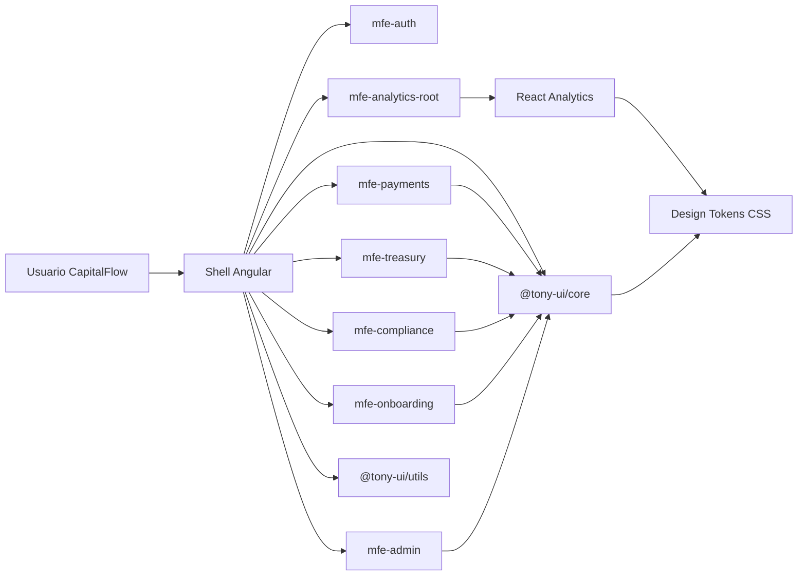
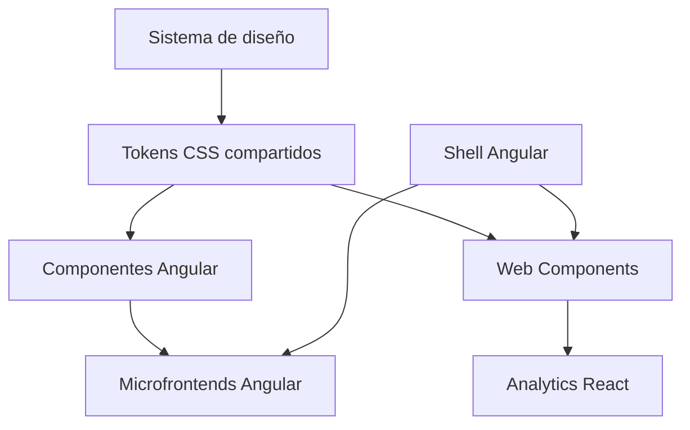
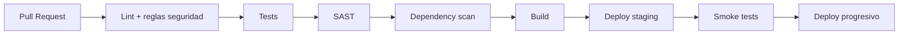
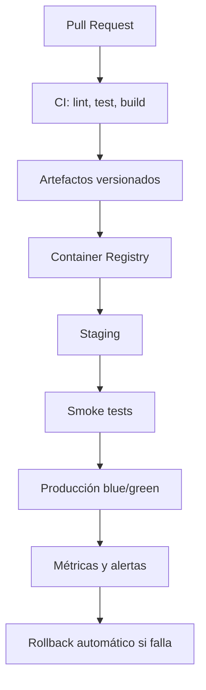

# CapitalFlow

## Propuesta Técnica de Modernización Angular Expert

**Cliente:** CapitalFlow - Plataforma SaaS B2B de gestión financiera  
**Autor:** Tony  
**Rol:** Arquitecto Consultor Externo  
**Versión:** 1.0  
**Fecha:** 24 de abril de 2026  
**Horizonte del plan:** 6 meses  
**Ventana crítica:** Due diligence de inversores en 8 semanas  

### Confidencialidad

Documento preparado para Board, CTO, equipos técnicos e inversores de CapitalFlow. Contiene una propuesta de arquitectura, seguridad, rendimiento, despliegue y gobierno técnico para una plataforma financiera regulada.

---

# Índice

1. Executive Summary  
2. Diagnóstico de Situación Actual  
3. Arquitectura Objetivo  
4. Plan de Optimización de Rendimiento  
5. Estrategia de Seguridad  
6. Roadmap de Refactoring Incremental  
7. Librería de Componentes Compartidos  
8. Modernización del Despliegue  
9. Plan de Ejecución a 6 Meses  
10. Análisis de Riesgos  
11. Métricas de Éxito  
12. Respuesta al Inversor sobre React  
13. Evidencia Práctica Incluida  
14. Instrucciones para Exportar a PDF  

---

# 1. Executive Summary

CapitalFlow tiene un riesgo técnico real para la ronda Serie B por cuatro factores principales: arquitectura acoplada, rendimiento insuficiente, vulnerabilidades de seguridad críticas y un proceso de despliegue manual con baja confiabilidad.

La recomendación es ejecutar una modernización incremental durante 6 meses, sin detener el desarrollo de producto, basada en:

- Nx como plataforma de monorepo y gobierno técnico.
- Microfrontends por dominio de negocio.
- Shell Angular como composition root.
- Integración de React mediante Web Components.
- Librería de componentes compartida y versionada.
- Hardening de seguridad compatible con SOC 2.
- CI/CD automatizado, contenedores y despliegue progresivo.

El objetivo de las primeras 8 semanas no es finalizar toda la transformación, sino demostrar a inversores y Board que existe una ruta creíble, ejecutable y medible. Para ello se entrega una vertical práctica que valida la arquitectura propuesta: shell Angular, remotes Angular, Analytics en React como Web Component, librería UI compartida, tests automatizados, CI y Docker.

## 1.1 Decisión Ejecutiva Recomendada

Aprobar el plan de modernización incremental, crear un equipo de plataforma con autoridad técnica transversal y ejecutar una primera fase enfocada en seguridad, independencia de despliegue, reducción de bundle inicial y consistencia visual.

## 1.2 Resultado Esperado

En 6 meses, CapitalFlow debe pasar de una plataforma frágil, lenta y manual a una plataforma modular, auditable, más segura y preparada para escalar equipos y releases sin bloquear el negocio.

---

# 2. Diagnóstico de Situación Actual

## 2.1 Problemas Identificados

| Área | Situación actual | Impacto en negocio | Severidad |
|---|---|---|---|
| Arquitectura | Build y deploy monolítico | Bloqueo entre equipos, releases lentas | Crítica |
| Equipos | Angular 16, 17, 18 y React conviven sin contrato común | Alto coste de coordinación | Alta |
| Rendimiento | Bundle inicial 2.8 MB, FCP 9.2 s, TTI 14 s | Riesgo de churn enterprise | Crítica |
| Seguridad | XSS, iframes inseguros, ausencia de CSP, cookies débiles | Riesgo SOC 2 e inversores | Crítica |
| Mantenibilidad | Servicios grandes, componentes de 800+ líneas, 3% cobertura | Features lentas y alto riesgo | Alta |
| Operación | Deploy manual, rollback manual, sin health checks | Riesgo de continuidad | Crítica |
| UI | Componentes duplicados y UX inconsistente | Baja confianza del usuario | Media |

## 2.2 Causas Raíz

1. Crecimiento acelerado sin plataforma compartida.
2. Ausencia de ownership técnico transversal.
3. Falta de límites de dominio y contratos entre equipos.
4. Ausencia de automatización de calidad y despliegue.
5. Diseño visual no implementado como librería reutilizable.
6. Seguridad tratada como auditoría puntual, no como proceso continuo.

## 2.3 Priorización

| Prioridad | Acción | Justificación |
|---|---|---|
| P0 | Remediar vulnerabilidades críticas | Requisito para SOC 2 y confianza inversora |
| P0 | Separar despliegues por dominio | Reduce riesgo operativo y desbloquea equipos |
| P1 | Integrar React con Web Components | Evita reescritura costosa y mantiene autonomía |
| P1 | Crear librería UI compartida | Reduce duplicación y unifica experiencia |
| P1 | Medir y optimizar rendimiento | Protege renovaciones enterprise |
| P2 | Refactor incremental | Reduce coste de evolución sin parar roadmap |

---

# 3. Arquitectura Objetivo

## 3.1 Principios

- Modernización incremental, no reescritura total.
- Autonomía por dominio con contratos explícitos.
- Coexistencia tecnológica controlada.
- Diseño compartido sin imponer framework único.
- Seguridad por defecto.
- CI/CD reproducible y auditable.
- Métricas como mecanismo de gobierno.

## 3.2 Vista General



## 3.3 Componentes Principales

| Elemento | Responsabilidad |
|---|---|
| `shell` | Routing, layout, navegación, guardas, carga de remotes y composición |
| `apps/mfe-auth` | Autenticación, sesión y roles demo |
| `apps/mfe-payments` | Pagos internacionales |
| `apps/mfe-treasury` | Tesorería |
| `apps/mfe-compliance` | Reporting regulatorio protegido por rol |
| `apps/mfe-onboarding` | Alta de clientes protegida por rol |
| `apps/mfe-admin` | Administración protegida por rol admin |
| `apps/mfe-analytics` | Dashboard React publicado como Web Component |
| `libs/core` | Librería UI `@tony-ui/core` |
| `libs/utils` | Datos demo, helpers y contratos compartidos |
| `projects/docs` | Documentación viva de la librería |

## 3.4 Coexistencia Angular y React

React no debe migrarse por obligación. La solución propuesta separa experiencia visual, contrato de integración y tecnología interna:



## 3.5 Alternativas Descartadas

| Alternativa | Motivo de descarte |
|---|---|
| Reescritura total a una versión única de Angular | Riesgo alto, coste alto, no compatible con el timeline |
| Forzar migración del equipo React | Rechazo del equipo, pérdida de conocimiento y coste prohibitivo |
| Mantener monolito con módulos internos | No resuelve independencia de despliegue ni ownership |
| Repositorios completamente separados | Reduce visibilidad de dependencias y complica gobierno |

---

# 4. Plan de Optimización de Rendimiento

## 4.1 Baseline Informado por el Cliente

| Métrica | Actual | Objetivo 8 semanas | Objetivo 6 meses |
|---|---:|---:|---:|
| Bundle inicial descargado | 2.8 MB | < 1.2 MB | < 800 KB |
| FCP en 4G | 9.2 s | < 5 s | < 3.5 s |
| TTI WiFi corporativo | 14 s | < 8 s | < 5 s |
| Tabla 80.000 registros | Congela 18 s | Paginación/virtualización | Interacción fluida |
| Export 120.000 filas | Bloqueo total UI | Proceso no bloqueante | Backend job/Web Worker |

## 4.2 Acciones Técnicas

1. Lazy loading por dominio.
2. Shell ligero con carga diferida de remotes.
3. Presupuestos de bundle por aplicación.
4. Virtualización o paginación para tablas masivas.
5. Exportaciones pesadas en backend o Web Worker.
6. Cache de assets versionados vía Nginx/CDN.
7. Métricas Web Vitals por mercado y cliente.

## 4.3 Estrategia para Navegadores Legacy

IE11 representa el 6% de usuarios, pero no debe condicionar toda la arquitectura. Se recomienda:

- Mantener soporte temporal mediante portal legacy o fallback aislado.
- Comunicar una fecha de sunset negociada con clientes bancarios.
- Medir uso real por cliente antes de retirar soporte.
- No frenar modernización del 94% restante por una dependencia legacy.

---

# 5. Estrategia de Seguridad

## 5.1 Remediación de Vulnerabilidades

| Vulnerabilidad | Acción |
|---|---|
| Comentarios renderizados en DOM | Renderizar como texto, sanitizar en backend y frontend |
| URLs dinámicas en iframe | Validar origen, eliminar `javascript:`, preferir enlaces firmados |
| Nombre de archivo con código | Normalizar, escapar y guardar metadata segura |
| Búsqueda reflejada | Encoding por defecto y no usar `innerHTML` |
| WYSIWYG permite scripts | Allowlist estricta de tags y atributos |
| Sin CSP | Configurar CSP por entorno |
| Cookies sin flags | `HttpOnly`, `Secure`, `SameSite` |

## 5.2 Política de Seguridad Objetivo



## 5.3 WYSIWYG Seguro

El editor WYSIWYG se mantiene porque es funcionalmente necesario, pero se encapsula:

- Allowlist de HTML permitido.
- Sanitización server-side.
- Sanitización client-side defensiva.
- Preview segura.
- Auditoría de cambios de plantilla.
- CSP que bloquee scripts inline no autorizados.

---

# 6. Roadmap de Refactoring Incremental

## 6.1 Enfoque

No se propone un refactor masivo. Se propone refactor incremental guiado por riesgo, frecuencia de cambio y coste de mantenimiento.

## 6.2 Patrones Propuestos

| Patrón | Uso |
|---|---|
| Facade Pattern | Reducir acoplamiento entre componentes y servicios grandes |
| Adapter Pattern | Encapsular APIs legacy |
| Container/Presentational | Reducir componentes gigantes |
| Feature boundaries | Evitar dependencias cruzadas entre dominios |
| Design system components | Eliminar duplicación visual |

## 6.3 Orden de Ejecución

1. Extraer componentes y utilidades compartidas.
2. Aislar servicios con mayor riesgo.
3. Reducir componentes de más de 800 líneas.
4. Añadir tests sobre reglas de negocio críticas.
5. Introducir métricas de complejidad y ownership.

---

# 7. Librería de Componentes Compartidos

## 7.1 Objetivo

Crear una librería que elimine duplicación, unifique la experiencia visual y permita evolución controlada sin romper consumidores.

## 7.2 Diseño de la Librería

| Capa | Descripción |
|---|---|
| Tokens | Variables CSS para color, tipografía, spacing y radius |
| Componentes Angular | API principal para equipos Angular |
| Web Components | Integración cross-framework para React |
| Docs | Catálogo vivo y ejemplos |
| Tests | Contrato de estabilidad |

## 7.3 Gobierno

- Versionado semántico.
- Changelog obligatorio.
- RFC ligero para breaking changes.
- Compatibilidad hacia atrás cuando sea viable.
- Tests visuales o de interacción para componentes críticos.

## 7.4 Evidencia Actual

La librería `@tony-ui/core` se encuentra en `libs/core`, se construye con `ng-packagr`, expone componentes standalone y cuenta con tests automatizados.

---

# 8. Modernización del Despliegue

## 8.1 Estado Objetivo

- CI con lint, tests y builds.
- Contenedores por aplicación.
- Health checks por servicio.
- Staging reproducible.
- Deploy progresivo.
- Rollback automatizado.
- Logs y métricas operativas.

## 8.2 Arquitectura de Deploy



## 8.3 Zero-Downtime

Para clientes regulados, el despliegue debe evitar interrupciones:

- Blue/green o rolling deployments.
- Health checks antes de enrutar tráfico.
- Compatibilidad temporal entre frontend y API.
- Feature flags para cambios funcionales.
- Rollback automático basado en métricas.

---

# 9. Plan de Ejecución a 6 Meses

## 9.1 Fases

| Fase | Periodo | Objetivo | Resultado esperado |
|---|---|---|---|
| Fase 0 | Semanas 1-2 | Gobierno, baseline y seguridad crítica | Plan aprobado y riesgos P0 contenidos |
| Fase 1 | Semanas 3-8 | Vertical demostrable | Shell, MFEs, React Web Component, CI y librería |
| Fase 2 | Semanas 9-16 | Escalado por dominios | Más dominios desacoplados, refactor crítico |
| Fase 3 | Semanas 17-24 | Operación madura | Zero-downtime, métricas y auditoría controlada |

## 9.2 Recursos

| Rol | Cantidad | Responsabilidad |
|---|---:|---|
| Arquitecto consultor | 1 | Dirección técnica y defensa |
| Arquitectos senior | 2 | Plataforma, seguridad y arquitectura |
| Desarrolladores | 14 | Migración incremental por dominio |
| Diseño | Compartido | Tokens, UX y componentes |
| Operaciones | Compartido | CI/CD, staging, observabilidad |

## 9.3 Presupuesto

El presupuesto de 450.000 euros se distribuye priorizando reducción de riesgo:

| Área | Porcentaje |
|---|---:|
| Plataforma y arquitectura | 30% |
| Seguridad y compliance | 25% |
| Rendimiento | 15% |
| Librería UI y UX | 15% |
| CI/CD y operación | 15% |

---

# 10. Análisis de Riesgos

| Riesgo | Probabilidad | Impacto | Mitigación |
|---|---:|---:|---|
| Resistencia de equipos | Media | Alta | Coexistencia, no migración forzada |
| Due diligence antes de resultados visibles | Alta | Alta | Vertical demostrable en 8 semanas |
| Cambios de seguridad rompen UX | Media | Alta | Feature flags, allowlists, pruebas con negocio |
| Sobrecarga del equipo plataforma | Media | Media | Templates y ownership claro |
| Dependencias legacy bloquean modernización | Media | Media | Portal legacy/fallback temporal |
| Falta de adopción de librería UI | Media | Media | Gobierno, docs y ejemplos prácticos |

---

# 11. Métricas de Éxito

## 11.1 KPIs Técnicos

| KPI | Baseline | Target |
|---|---:|---:|
| Build/deploy monolítico | 14 min | Deploy por dominio |
| Fallos de pipeline | 25% | < 5% |
| Deploy producción | 4-5 h | < 30 min |
| Rollback | 2-3 h manual | < 10 min automático |
| Cobertura tests | 3% | > 35% en dominios críticos |
| Vulnerabilidades críticas | 11 | 0 abiertas |
| Bundle inicial | 2.8 MB | < 800 KB |

## 11.2 KPIs de Negocio

| KPI | Objetivo |
|---|---|
| Incidentes SLA | Reducción sostenida trimestral |
| Renovación cliente enterprise | Evitar churn por performance |
| Tiempo medio de feature | Reducir de 6-8 días a 2-4 días |
| Releases independientes | Cada dominio puede desplegar sin bloquear al resto |
| Confianza inversora | Evidencia medible en 8 semanas |

---

# 12. Respuesta al Inversor sobre React

Pregunta del inversor:

> Si el equipo de Analytics quiere seguir en React para siempre, ¿cómo consigues que los usuarios vivan una experiencia unificada y el equipo de diseño mantenga consistencia visual sin forzar una migración?

Respuesta:

La consistencia no debe depender de que todos los equipos usen el mismo framework. Debe depender de contratos de experiencia compartidos: design tokens, componentes interoperables, reglas de UX, documentación viva y métricas comunes.

Analytics puede seguir en React indefinidamente si consume:

1. Tokens visuales comunes.
2. Web Components publicados por la librería compartida.
3. Contratos de navegación y layout definidos por el shell.
4. Métricas de rendimiento y UX equivalentes al resto de dominios.
5. Revisión de diseño dentro del mismo governance que Angular.

Así se protege la autonomía del equipo React sin fragmentar la experiencia del usuario final.

---

# 13. Evidencia Práctica Incluida

El repositorio asociado demuestra la propuesta con una implementación funcional:

| Requisito del examen | Evidencia |
|---|---|
| Microfrontends | Shell Angular y remotes por dominio |
| React integrado | `mfe-analytics-root` como Web Component |
| Web Components | `ton-button-wc` desde `@tony-ui/core` |
| Librería de componentes | `libs/core` |
| Tests | 61 specs y 493 tests pasando |
| CI/CD | `.github/workflows/ci.yml` y `npm run ci:validate` |
| Docker | `docker-compose.yml` con servicios por app |
| Seguridad | Nginx con CSP, headers y `healthz` |
| Documentación | README, runbook y propuesta ejecutiva |

## 13.1 Comandos de Validación

```bash
npm ci
npm run ci:validate
npx nx test core
npx nx build mfe-analytics --configuration production
docker compose config
```

---

# 14. Instrucciones para Exportar a PDF

## 14.1 Opción Recomendada con VS Code

1. Abrir este archivo Markdown.
2. Instalar una extensión como `Markdown PDF` o usar la vista previa de Markdown.
3. Exportar a PDF.
4. Revisar que los diagramas Mermaid rendericen correctamente.

## 14.2 Opción con Pandoc

Si tienes Pandoc instalado:

```bash
pandoc deliverables/CAPITALFLOW_EXECUTIVE_PROPOSAL.md ^
  -o deliverables/CAPITALFLOW_EXECUTIVE_PROPOSAL.pdf ^
  --toc ^
  --number-sections
```

## 14.3 Recomendación de Presentación

Para una defensa más profesional:

- Añadir logo de CapitalFlow o del proyecto en portada.
- Exportar con tabla de contenidos.
- Mantener diagramas Mermaid como imágenes si la herramienta no los renderiza.
- Incluir una página final con comandos de validación ejecutados.
- Llevar capturas del shell, docs y dashboard React para la defensa oral.

