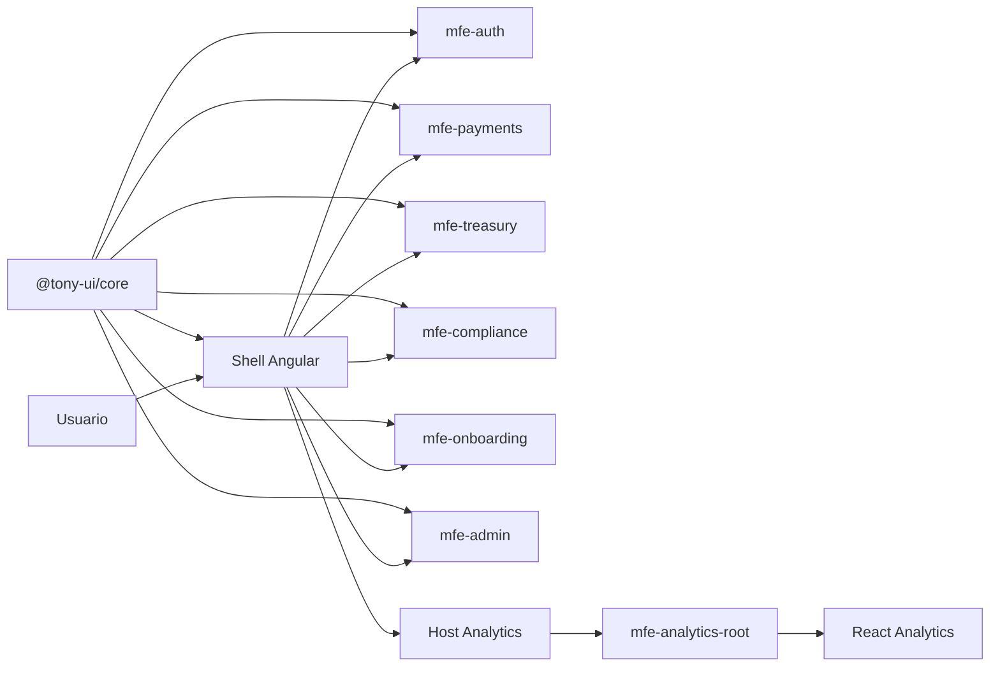
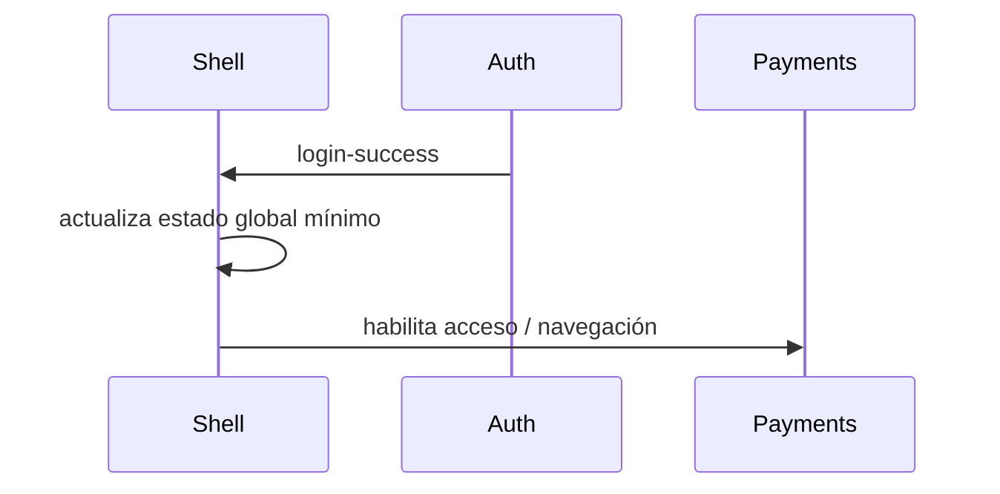

# Guia de Microfrontends

## Comunicacion, Servicios Compartidos, Contratos y Buenas Practicas con SOLID

**Proyecto de referencia:** `tony-monorepo`  
**Objetivo del documento:** explicar de forma clara, profesional y defendible como funciona una arquitectura de microfrontends, como deben comunicarse, que deben compartir, que no deben compartir y como aplicar principios SOLID en un contexto enterprise.

---

## 1. Que es un microfrontend

Un microfrontend es una forma de dividir una aplicacion frontend grande en partes mas pequeñas, independientes y alineadas con dominios de negocio. La idea no es partir la UI "por capricho", sino permitir que distintos equipos puedan:

- desarrollar de forma mas autonoma;
- desplegar con menor radio de impacto;
- evolucionar modulos a ritmos distintos;
- y reducir el acoplamiento de un frontend monolitico.

En este proyecto, los microfrontends no se separan por widgets visuales sueltos, sino por dominios funcionales:

- `mfe-auth`
- `mfe-payments`
- `mfe-treasury`
- `mfe-compliance`
- `mfe-onboarding`
- `mfe-admin`
- `mfe-analytics`

Esto es importante para la defensa porque demuestra que la separacion sigue bounded contexts del negocio y no solo conveniencia tecnica.

---

## 2. Por que usar microfrontends

Los microfrontends se justifican cuando el problema principal ya no es solo renderizar pantallas, sino gobernar una plataforma con:

- multiples equipos;
- diferentes ritmos de release;
- distintos dominios funcionales;
- y necesidad de aislar cambios.

### Ventajas

- Permiten ownership claro por equipo.
- Reducen el impacto de errores entre dominios.
- Favorecen despliegues mas independientes.
- Hacen mas natural la coexistencia tecnologica.
- Encajan bien con organizaciones grandes o en crecimiento.

### Riesgos

- Si se comparten demasiadas cosas, dejan de ser "micro".
- Si cada equipo hace todo distinto, aparece caos arquitectonico.
- Si no existen contratos claros, la integracion se vuelve fragil.
- Si se trocea demasiado, aumenta la complejidad operativa.

La clave no es "usar microfrontends", sino **usarlos con gobierno tecnico**.

---

## 3. Como estan aplicados en tu proyecto

En este monorepo, la arquitectura sigue este modelo:



### Roles principales

| Elemento | Rol |
|---|---|
| `shell` | Punto de entrada, layout, navegación, composición |
| Remotes Angular | Dominios funcionales independientes |
| `mfe-analytics` | Dominio React integrado como Web Component |
| `libs/core` | Librería UI compartida |
| `libs/utils` | Utilidades y contratos transversales |

El shell actúa como orquestador. No debe convertirse en un "superfrontend" con toda la lógica. Su responsabilidad es componer.

---

## 4. Tipos de comunicacion entre microfrontends

Uno de los puntos más importantes en arquitectura de microfrontends es decidir **cómo se comunican**. Este punto suele ser preguntado en defensas técnicas porque revela si la arquitectura es realmente desacoplada o si solo está fragmentada físicamente.

### 4.1 Comunicacion por routing

Es la más simple y suele ser la más sana.

Cada microfrontend representa una capacidad del sistema y el shell decide cuándo cargarlo en función de la ruta:

- `/auth`
- `/payments`
- `/treasury`
- `/compliance`
- `/analytics`

### Ventajas

- Bajo acoplamiento.
- Integración fácil de razonar.
- Ownership claro.
- Menor dependencia entre equipos.

### Buena práctica

Siempre que sea posible, preferir comunicación por navegación y composición, en lugar de mensajería constante entre remotes.

---

### 4.2 Comunicacion por inputs/props o atributos

Cuando un shell o un host necesita pasar datos a un microfrontend, lo ideal es usar un contrato explícito.

En Angular esto puede verse como:

- `@Input`
- parámetros de ruta
- `route data`

En Web Components, como en tu integración React, puede verse como:

- atributos HTML;
- propiedades del custom element;
- eventos personalizados.

### Buena práctica

Los datos que se pasan deben ser:

- mínimos;
- serializables cuando sea posible;
- bien tipados;
- y estables en el tiempo.

No conviene pasar objetos gigantes ni referencias vivas complejas que acoplen demasiado los módulos.

---

### 4.3 Comunicacion por eventos

Es útil cuando se quiere desacoplar emisores y receptores.

Ejemplos:

- un microfrontend emite "usuario autenticado";
- otro emite "filtro global actualizado";
- un Web Component emite "dashboard listo";
- el shell escucha "logout solicitado".

### Ejemplo conceptual



### Buena práctica

Los eventos deben representar hechos del dominio, no detalles internos de implementación.

Bien:

- `user-authenticated`
- `report-export-requested`
- `session-expired`

Mal:

- `button-clicked-in-component-x`
- `internal-store-updated`

---

### 4.4 Comunicacion mediante estado compartido

Es la que más cuidado requiere.

Puede ser útil para:

- identidad del usuario;
- permisos;
- idioma;
- tema visual;
- contexto de tenant;
- feature flags.

Pero si se usa mal, destruye el desacoplamiento.

### Regla importante

Compartir **estado transversal**, no **estado de negocio interno**.

Correcto compartir:

- usuario actual;
- rol;
- locale;
- configuración de entorno;
- flags globales.

Incorrecto compartir:

- estado interno de pagos;
- formularios de tesorería;
- selección local de una tabla de compliance.

---

## 5. Formas recomendadas de comunicacion en una arquitectura enterprise

En una plataforma empresarial, el orden recomendado de preferencia suele ser este:

1. Comunicación por routing.
2. Comunicación por contrato explícito.
3. Comunicación por eventos de dominio.
4. Estado compartido mínimo y transversal.
5. Comunicación directa entre microfrontends solo en casos muy justificados.

### Lo que se debe evitar

- Que `mfe-payments` llame directamente métodos internos de `mfe-treasury`.
- Que un microfrontend lea stores privados de otro.
- Que se compartan singletons con demasiada lógica de negocio.
- Que varios dominios dependan del mismo servicio mutable con efectos colaterales.

---

## 6. Servicios compartidos: que si compartir y que no

Esta es una de las decisiones más delicadas.

### Si compartir

Se pueden compartir servicios o utilidades cuando son realmente transversales:

- formateadores;
- utilidades de fechas;
- componentes UI;
- logging;
- telemetría;
- wrappers de configuración;
- contratos TypeScript;
- helpers puros;
- autenticación transversal si es solo frontera común.

### No compartir

No conviene compartir como librería transversal:

- lógica específica de pagos;
- lógica específica de compliance;
- reglas de negocio mezcladas entre dominios;
- stores globales que contienen demasiadas responsabilidades.

### Regla práctica

Si algo cambia por una decisión del negocio de un solo dominio, probablemente **no** debe vivir en una librería compartida global.

---

## 7. Que significa un contrato compartido

Un contrato es una definición estable de cómo un módulo expone comportamiento o datos a otro.

Puede ser:

- una interfaz TypeScript;
- un evento con payload definido;
- un custom element con propiedades documentadas;
- una ruta con parámetros esperados;
- una API pública de librería.

### Ejemplo conceptual

```ts
export interface UserSession {
  id: string;
  role: 'admin' | 'analyst' | 'operator';
  locale: string;
}
```

Esto es mejor que compartir objetos informales sin estructura, porque:

- documenta expectativas;
- facilita test;
- reduce dependencias ocultas;
- y permite evolucionar sin romper consumidores por accidente.

---

## 8. Microfrontends y principios SOLID

Aquí está una de las partes más importantes para tu defensa: demostrar que los microfrontends no son solo una separación física, sino una arquitectura pensada con principios de diseño.

---

## 8.1 S: Single Responsibility Principle

Cada módulo debe tener una responsabilidad clara.

### Aplicado a microfrontends

- `mfe-payments` debe centrarse en pagos.
- `mfe-compliance` debe centrarse en reporting regulatorio.
- `mfe-analytics` debe centrarse en dashboards e informes.
- `shell` debe centrarse en componer, navegar y aplicar políticas transversales.

### Mala práctica

Que el shell contenga reglas de negocio de varios dominios.

### Buena práctica

Cada microfrontend encapsula su lógica y el shell solo orquesta.

---

## 8.2 O: Open/Closed Principle

Los módulos deben poder extenderse sin tener que modificar continuamente el núcleo.

### Aplicado a microfrontends

Si mañana agregas `mfe-risks`, la arquitectura ideal permite incorporarlo:

- añadiendo una nueva ruta;
- un nuevo remote;
- un nuevo contrato visual;

sin tener que reescribir todos los módulos existentes.

### Buena práctica

Diseñar APIs, contratos y puntos de integración estables desde el shell y las librerías compartidas.

---

## 8.3 L: Liskov Substitution Principle

Si defines un contrato, cualquier implementación válida debe respetarlo sin sorprender al consumidor.

### Aplicado a microfrontends

Si un Web Component o una librería compartida promete:

- una propiedad;
- un evento;
- o un comportamiento de UX;

distintas implementaciones deben mantener ese comportamiento esperado.

### Ejemplo

Si todos los botones del design system comparten semántica visual y accesibilidad, da igual si un consumidor interno es Angular o React: la experiencia debe ser consistente.

---

## 8.4 I: Interface Segregation Principle

No obligues a un consumidor a depender de cosas que no necesita.

### Aplicado a microfrontends

En lugar de exponer una "mega API" del shell o de una librería compartida, conviene exponer interfaces pequeñas y específicas.

Mejor:

- contrato de sesión;
- contrato de navegación;
- contrato de telemetría.

Peor:

- un `AppPlatformService` gigante que tiene auth, logging, routing, métricas y feature flags en una sola clase.

---

## 8.5 D: Dependency Inversion Principle

Los módulos de alto nivel no deben depender de detalles concretos; deben depender de abstracciones.

### Aplicado a microfrontends

El shell no debería acoplarse a internals de React.

Por eso en tu proyecto es una buena decisión que Analytics entre como custom element y no como dependencia directa de una API interna de React.

También aplica a librerías compartidas:

- los consumidores deben depender de contratos públicos;
- no de archivos internos o estructuras privadas.

---

## 9. Como defender la comunicacion entre microfrontends

Si te preguntan cómo se comunican, una respuesta fuerte sería:

> "Priorizo una comunicación desacoplada. El mecanismo principal es routing y composición desde el shell. Cuando hace falta intercambio de información, uso contratos explícitos o eventos de dominio. El estado compartido se limita a concerns transversales como sesión, rol, entorno o diseño visual. Evito que un microfrontend dependa directamente del store o de la lógica interna de otro."

Esa respuesta transmite:

- criterio;
- control del acoplamiento;
- y diseño enterprise.

---

## 10. Buenas practicas concretas

### 10.1 Alineacion por dominio

Cada microfrontend debe mapear una capacidad de negocio clara. No conviene dividir por widgets o por secciones demasiado pequeñas.

### 10.2 APIs públicas mínimas

Cada remote debe exponer lo mínimo necesario. No conviene publicar internals ni servicios innecesarios.

### 10.3 Evitar shared state excesivo

El estado compartido debe ser mínimo y transversal. Cuanto más estado de negocio se comparte, más falso es el desacoplamiento.

### 10.4 Librerías compartidas pequeñas y estables

Compartir solo:

- UI;
- utilidades puras;
- contratos;
- y servicios realmente transversales.

### 10.5 Versionado y compatibilidad

Las librerías compartidas deben versionarse y evolucionar con cuidado. Si rompes `@tony-ui/core`, puedes romper varios dominios a la vez.

### 10.6 Observabilidad uniforme

Aunque los módulos sean independientes, las métricas de frontend deben leerse de forma unificada:

- errores;
- tiempos de navegación;
- rendimiento;
- eventos de negocio.

### 10.7 Seguridad transversal

No debe ocurrir que un microfrontend siga reglas de seguridad y otro no. La base común de seguridad debe venir de:

- librerías compartidas;
- pipeline;
- lint rules;
- políticas de shell;
- y cultura de equipo.

### 10.8 Testing por responsabilidad

Cada microfrontend debe probar su comportamiento.

Además, la plataforma debe tener:

- tests de integración entre shell y remotes;
- tests de contratos compartidos;
- smoke tests del flujo principal.

---

## 11. Anti patrones frecuentes

### 11.1 El shell dios

Sucede cuando el shell empieza a contener:

- lógica de negocio;
- estado global excesivo;
- llamadas HTTP específicas;
- validaciones de dominio.

Eso convierte la arquitectura otra vez en un monolito.

### 11.2 La librería compartida monstruo

Sucede cuando todo acaba en una sola librería común y ya nadie sabe qué pertenece a quién.

### 11.3 Comunicación caótica por eventos

Si todo emite eventos sin gobierno, termina siendo difícil seguir el flujo de la aplicación.

### 11.4 Falsa independencia

Pasa cuando cada microfrontend es "independiente", pero todos dependen de los mismos servicios mutables y del mismo estado global.

### 11.5 Compartir lógica de negocio entre dominios sin criterio

Eso provoca dependencias circulares conceptuales, aunque el código no las marque explícitamente.

---

## 12. Servicios compartidos bien diseñados

Una manera madura de diseñarlos es clasificarlos:

| Tipo | Compartible | Ejemplos |
|---|---|---|
| UI | Sí | botones, inputs, modales, tabs |
| Utilidades puras | Sí | formatters, date helpers, mappers |
| Configuración | Sí | entornos, URLs, flags |
| Observabilidad | Sí | logging, tracing, analytics |
| Sesión transversal | Sí, con cuidado | usuario actual, rol, tenant |
| Lógica de negocio de dominio | No | pagos, compliance, treasury |
| Estado interno de feature | No | formularios, filtros locales, selección de tablas |

---

## 13. Microfrontends y Web Components

En tu caso, esta parte es especialmente importante porque te la pueden preguntar.

### Por que usar Web Components para React

Porque ofrecen una frontera estable entre frameworks:

- Angular no necesita conocer internals de React.
- React conserva autonomía tecnológica.
- El shell integra mediante un contrato claro.
- Se reduce el acoplamiento cross-framework.

### Cómo se comunican en este modelo

- el shell carga el script del custom element;
- el custom element se registra;
- el host lo renderiza;
- se le pueden pasar propiedades o atributos;
- y puede emitir eventos hacia el shell.

### Qué ganas

- interoperabilidad real;
- menor riesgo de migración;
- y mejor historia enterprise de coexistencia tecnológica.

---

## 14. Como explicar esto en una defensa

Puedes decir algo como esto:

> "La arquitectura de microfrontends no la planteé como una moda, sino como una respuesta al acoplamiento entre equipos y despliegues. Separé los dominios por bounded context, dejé al shell como composition root y limité la comunicación a routing, contratos explícitos y eventos de dominio cuando son necesarios. Los servicios compartidos se restringen a concerns transversales como UI, utilidades, configuración y observabilidad. La lógica de negocio sigue dentro de cada dominio. Además, esta separación está alineada con principios SOLID: responsabilidad única por dominio, interfaces pequeñas, dependencia de abstracciones y puntos de extensión estables."

Esa respuesta es fuerte porque une:

- arquitectura;
- buenas prácticas;
- negocio;
- y diseño orientado a mantenimiento.

---

## 15. Conclusiones clave

### Idea 1

Un microfrontend no es simplemente "una app pequeña". Es una unidad de negocio, integración y despliegue con responsabilidad clara.

### Idea 2

La mejor comunicación entre microfrontends es la mínima necesaria.

### Idea 3

Compartir UI, contratos y utilidades suele ser correcto. Compartir lógica de negocio entre dominios suele ser peligroso.

### Idea 4

SOLID sí aplica a microfrontends:

- responsabilidad clara;
- extensibilidad sin romper el núcleo;
- contratos estables;
- interfaces pequeñas;
- dependencia de abstracciones.

### Idea 5

La convivencia Angular/React puede ser perfectamente enterprise si está gobernada por contratos, diseño compartido y límites claros.

---

## 16. Mensaje final para tu defensa

Si quieres cerrar esta parte con una frase senior, usa algo así:

> "Mi objetivo no fue solo dividir el frontend, sino dividirlo bien: por dominio, con contratos claros, con comunicación mínima, con reutilización gobernada y con principios SOLID para que la independencia de hoy no se convierta en el caos de mañana."

